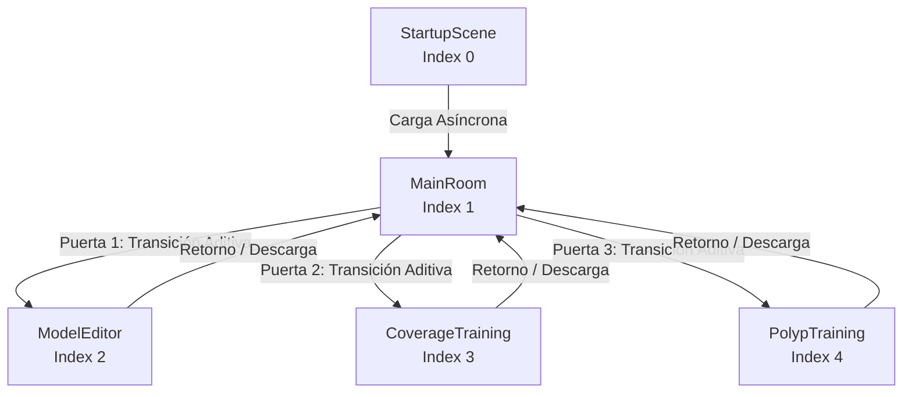
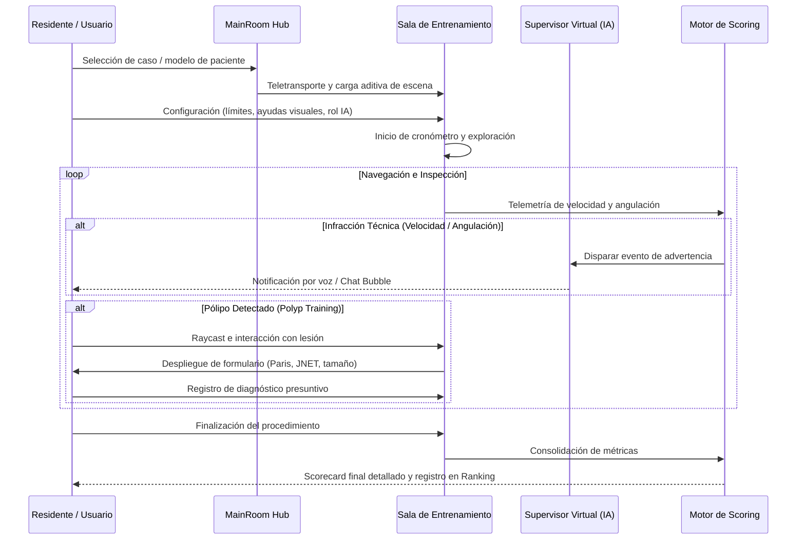

# LoGiViT — Visión General de Arquitectura y Estructura del Proyecto

**Lower Gastrointestinal Virtual Training (LoGiViT)** es una plataforma de simulación médica avanzada en **Realidad Virtual (VR)**, orientada al entrenamiento clínico de procedimientos de **colonoscopia diagnóstica e intervencionista**.

El sistema integra generación anatómica procedural del tracto intestinal, inspección óptica con endoscopio virtual y físico, detección y clasificación diagnóstica de patologías según estándares internacionales (Paris y JNET), análisis en tiempo real de cobertura mucosa acelerado por hardware, y un supervisor virtual interactivo guiado por modelos de lenguaje (LLM) y síntesis de voz (TTS).

---

## 1. Ficha Técnica

| Parámetro | Detalle |
| :--- | :--- |
| **Motor de Juego** | Unity 6000.4.0f1 (Unity 6.4) |
| **Pipeline de Renderizado** | High Definition Render Pipeline (HDRP 17.4.0) |
| **Plataformas Objetivo** | Windows PC (Exclusivo para Realidad Virtual mediante OpenXR) |
| **Integración XR** | Unity XR Interaction Toolkit 3.4.0, Unity XR Hands 1.7.3, OpenXR 1.16.1 |
| **Entrada Física / Hardware** | Comunicación serie RS-232/USB ([SerialUSB.cs](Assets/Scripts/SerialUSB.cs)) para endoscopios físicos de simulación |
| **Inteligencia Artificial** | Local (Ollama - Llama 3.2), Cloud (OpenAI GPT-4o-mini, Whisper, TTS-1) y Google Cloud Text-to-Speech |
| **Localización** | Unity Localization 1.5.8 (soporte multilingüe para textos y voces del asistente) |

---

## 2. Mapa de Escenas y Ciclo de Vida de la Aplicación

El orden de carga e índices de escena se encuentran configurados en [EditorBuildSettings.asset](ProjectSettings/EditorBuildSettings.asset):

```
Build Index:
  [0] StartupScene        -> Inicialización persistente y bootstrap
  [1] MainRoom            -> Hub central hospitalario y selección de sesiones
  [2] ModelEditor         -> Estudio de parametrización y generación procedural del colon
  [3] CoverageTraining    -> Módulo de entrenamiento de cobertura mucosal
  [4] PolypTraining       -> Módulo de entrenamiento de detección y diagnóstico de pólipos
(Fuera de Build):
  [-] RecordingRoom       -> Escena técnica para renderizado de miniaturas y captura de datasets
```



### 2.1. `StartupScene.unity` (Índice 0)
- **Propósito:** Inicialización del ecosistema global.
- **Componentes Clave:**
  - [ApplicationManager.cs](Assets/Scripts/Scenes/StartupScene/ApplicationManager.cs): Singleton con `[DefaultExecutionOrder(-100)]` persistente con `DontDestroyOnLoad`. Coordina los ajustes generales, el modelo colónico activo (`_currentModel`) y la inicialización de [FileManager.cs](Assets/Scripts/FileManagement/FileManager.cs).
  - [SceneFlowController.cs](Assets/Scripts/Scenes/StartupScene/SceneFlowController.cs): Singleton persistente que administra la pila de escenas cargadas aditivamente, la visualización de modales de carga y la inyección de proveedores de teletransporte e interfaces de mandos XR.
  - [AppSettingsController.cs](Assets/Scripts/Scenes/StartupScene/AppSettingsController.cs): Configuración de gráficos HDRP, volumen sonoro, API keys y parámetros de interacción.

### 2.2. `MainRoom.unity` (Índice 1)
- **Propósito:** Consulta / antesala hospitalaria que funciona como centro de mando del usuario.
- **Componentes Clave:**
  - [MainRoomManager.cs](Assets/Scripts/Scenes/MainRoom/MainRoomManager.cs): Gestiona el estado de la sala principal y la interacción inicial.
  - [ColonoscopyRoomsTransitionController.cs](Assets/Scripts/Scenes/MainRoom/ColonoscopyRoomsTransitionController.cs): Coordina la apertura y cierre de puertas interactivas ([PracticableDoorsController.cs](Assets/Scripts/Scenes/MainRoom/PracticableDoorsController.cs)) y el teletransporte del usuario entre el hub y las salas secundarias de entrenamiento o edición.
  - [ModelFileBrowserController.cs](Assets/Scripts/Scenes/MainRoom/ModelFileBrowserController.cs): Permite seleccionar pacientes/modelos guardados en disco o cargados desde `StreamingAssets`.

### 2.3. `ModelEditor.unity` (Índice 2)
- **Propósito:** Estudio tridimensional para crear, manipular y exportar modelos de intestino grueso.
- **Componentes Clave:**
  - [ModelEditorManager.cs](Assets/Scripts/Scenes/ModelEditor/ModelEditorManager.cs): Orquestador principal con ejecución prioritaria `[DefaultExecutionOrder(-200)]`. Implementa el patrón Mediador y coordina cinco controladores de modo de edición:
    1. **Tracto ([TractEditionModeController.cs](Assets/Scripts/Scenes/ModelEditor/EditionModes/TractEditionModeController.cs)):** Manipulación directa de los nodos de la spline 3D mediante asas de agarre XR.
    2. **Preajustes ([PresetEditionModeController.cs](Assets/Scripts/Scenes/ModelEditor/EditionModes/PresetEditionModeController.cs)):** Guardado, carga y clonación de perfiles anatómicos y curvas.
    3. **Detalles ([DetailsEditionModeController.cs](Assets/Scripts/Scenes/ModelEditor/EditionModes/DetailsEditionModeController.cs)):** Modificación de haustras y calibre colónico mediante *blendshapes*.
    4. **Patologías ([DiseaseEditionModeController.cs](Assets/Scripts/Scenes/ModelEditor/EditionModes/DiseaseEditionModeController.cs)):** Colocación tridimensional y proyección de pólipos en las paredes internas.
    5. **Previsualización ([PreviewEditionModeController.cs](Assets/Scripts/Scenes/ModelEditor/EditionModes/PreviewEditionModeController.cs)):** Navegación libre por el interior del lumen del colon generado.

### 2.4. `CoverageTraining.unity` (Índice 3)
- **Propósito:** Sesión clínica para entrenar la retirada endoscópica y evaluar qué porcentaje de mucosa ha sido visualizada minuciosamente.
- **Componentes Clave:**
  - [CoverageTrainingManager.cs](Assets/Scripts/Scenes/CoverageTraining/CoverageTrainingManager.cs): Administra el ciclo del entrenamiento, cronometraje y cálculo de nota final.
  - [NewCameraCoverage.cs](Assets/Scripts/Scenes/CoverageTraining/NewCameraCoverage.cs): Rastreo de cobertura de superficie mediante Unity Jobs y Burst Compiler.
  - [CoverageTrainingRankingPolicy.cs](Assets/Scripts/Scenes/CoverageTraining/CoverageTrainingRankingPolicy.cs): Reglas de puntuación basadas en cobertura total, cobertura por segmento (recto, sigma, descendente, transverso, ascendente, ciego) y penalizaciones por tiempo o aceleración inadecuada.

### 2.5. `PolypTraining.unity` (Índice 4)
- **Propósito:** Detección de lesiones colónicas y clasificación morfológica/histológica virtual.
- **Componentes Clave:**
  - [PolypTrainingManager.cs](Assets/Scripts/Scenes/PolypTraining/PolypTrainingManager.cs): Conduce la sesión de entrenamiento intervencionista.
  - [PolypDetectionController.cs](Assets/Scripts/Scenes/PolypTraining/PolypDetectionController.cs): Detecta cuando el estudiante enfoca y selecciona un pólipo en la luz colónica.
  - [PolypIdentificationController.cs](Assets/Scripts/Scenes/PolypTraining/PolypIdentificationController.cs): Despliega un formulario clínico interactivo donde el residente debe evaluar:
    - **Morfología (Clasificación de Paris):** Polipoide pediculado (`0-Ip`), polipoide sésil (`0-Is`), plano elevado (`0-IIa`), plano superficial (`0-IIb`), ligeramente deprimido (`0-IIc`) o excavado (`0-III`).
    - **Patrón Microvascular/Mucoso (Clasificación JNET):** Tipo 1 (hiperplásico), Tipo 2A (adenoma de bajo grado), Tipo 2B (adenoma de alto grado / carcinoma superficial), Tipo 3 (carcinoma invasor profundo).
    - **Tamaño Estimado:** En milímetros, contrastado frente a distractores estocásticos generados dinámicamente.
    - **Segmento Colónico:** Ubicación anatómica precisa.

### 2.6. `RecordingRoom.unity` (Herramienta Técnica)
- **Propósito:** Automatización de capturas, rotación orbital de modelos 3D y generación de vistas en miniatura ([ModelPreviewRecorder.cs](Assets/Scripts/ModelPreviewRecorder.cs)).

---

## 3. Subsistemas y Arquitectura de Código (`Assets/Scripts/`)

El código fuente de LoGiViT sigue una arquitectura modular desacoplada, orientada a eventos, con inversión de dependencias y optimización de bajo nivel para renderizado en tiempo real en HDRP y Realidad Virtual.

A continuación se detalla la estructura completa de **todas las subcarpetas** dentro de [Assets/Scripts](Assets/Scripts):

```
Assets/Scripts/
├── Common/            # Geometría computacional, álgebra 3D, utilidades de malla y algoritmos
├── CustomUI/          # Sistema completo de UI espacial 3D y 2D adaptado a XR y Escritorio
├── Diseases/          # Definición clínica, morfología y catálogo de patologías/pólipos
├── Endoscope/         # Dinámica física, óptica de cámara y navegación del endoscopio
├── FileManagement/    # Sistema de archivos, persistencia I/O, cifrado y formatos de exportación
├── Input/             # Mapeo lógico y visual de mandos XR (Meta Quest, HTC Vive)
├── LargeIntestine/    # Definición anatómica, generadores de perfiles, haustras
├── Messages/          # Sistema desacoplado de eventos, avisos y notificaciones en pantalla
├── Scenes/            # Controladores específicos por escena y módulos compartidos
│   ├── StartupScene/      # Inicialización persistente y bootstrap global
│   ├── MainRoom/          # Hub hospitalario, puertas practicables y transiciones
│   ├── ModelEditor/       # Estudio procedural del colon y modos de edición
│   ├── CoverageTraining/  # Medición y puntuación de cobertura mucosal
│   ├── PolypTraining/     # Detección y diagnóstico clínico de pólipos
│   └── SceneCommons/      # IA (Ollama/OpenAI), audio, endoscopio común y HUD
├── Serialization/     # Conversores JSON personalizados de Newtonsoft para geometría y estado
├── Tests/             # Utilidades de medición métrica y pruebas de soldadura de mallas
├── UVComputing/       # Desenvolvimiento UV cilíndrico, corrección de normales y puente con Blender
└── VRTemplateAssets/  # Componentes auxiliares de interacción háptica y cinemática en VR
```

---

### 3.1. `Common/`: Geometría Computacional, Algoritmos y Utilidades de Malla

Esta carpeta es el núcleo matemático del proyecto. Contiene una biblioteca de geometría computacional de bajo nivel desarrollada en C# para resolver problemas de topología, cálculo de normales y manipulación de mallas sin cajas negras externas.

#### Subcarpetas Internas de `Common/`:
- **`GeometryUtils/`**:
  - [MeshData.cs](Assets/Scripts/Common/GeometryUtils/MeshData.cs) y [MeshDataStructures.cs](Assets/Scripts/Common/GeometryUtils/MeshDataStructures.cs): Contenedores desacoplados de vértices, triángulos, normales, tangentes y UVs optimizados para manipulación en memoria sin sobrecargar la API de Unity.
  - [BlendshapeNormalFixer.cs](Assets/Scripts/Common/GeometryUtils/BlendshapeNormalFixer.cs): Corrige artefactos de sombreado y normales invertidas al deformar el colon mediante *blendshapes*.
  - [EditorMeshUtils.cs](Assets/Scripts/Common/GeometryUtils/EditorMeshUtils.cs) y [MeshUtility.cs](Assets/Scripts/Common/GeometryUtils/MeshUtility.cs): Funciones auxiliares para duplicación profunda, transformación espacial e inversión de winding de mallas.
- **`Utilities/`**:
  - [ImprovedMeshWeld.cs](Assets/Scripts/Common/Utilities/ImprovedMeshWeld.cs) y [NewWelder.cs](Assets/Scripts/Common/Utilities/NewWelder.cs): Algoritmos de soldadura de vértices coincidentes por proximidad métrica (`_weldingPosThreshold`) utilizando *spatial hashing* para reducir la complejidad temporal a $O(N)$.
  - [NormalSolver.cs](Assets/Scripts/Common/Utilities/NormalSolver.cs): Recálculo de normales ponderadas por ángulo de cara para suavizado en costuras.
  - [CameraUtils.cs](Assets/Scripts/Common/Utilities/CameraUtils.cs) y [CameraLightsMasking.cs](Assets/Scripts/Common/Utilities/CameraLightsMasking.cs): Manejo de máscaras de iluminación y capas para la cámara del endoscopio en HDRP.
  - [Debugger.cs](Assets/Scripts/Common/Utilities/Debugger.cs) y [FPSCounter.cs](Assets/Scripts/Common/Utilities/FPSCounter.cs): Trazabilidad de llamadas y monitorización de rendimiento en cascos XR.
  - [ObjLoaderFromFile.cs](Assets/Scripts/Common/Utilities/ObjLoaderFromFile.cs): Cargador en caliente de mallas Wavefront OBJ.
- **`DelaunayTriangulation/`**:
  - Implementación completa de triangulación de Delaunay 2D y 3D ([DelaunayTriangulation.cs](Assets/Scripts/Common/DelaunayTriangulation/DelaunayTriangulation.cs), [DelaunayTriangle.cs](Assets/Scripts/Common/DelaunayTriangulation/DelaunayTriangle.cs), [PointBinGrid.cs](Assets/Scripts/Common/DelaunayTriangulation/PointBinGrid.cs)) para la reconstrucción de secciones transversales y tapas del colon.
- **`BaseClasses/`**:
  - [BlendVertex.cs](Assets/Scripts/Common/BaseClasses/BlendVertex.cs): Estructura representativa de vértices sometidos a interpolación entre mallas base y deltas de blendshape.
- **`UnityEditor/`**:
  - [MeshCombinerWindow.cs](Assets/Scripts/Common/UnityEditor/MeshCombinerWindow.cs): Herramienta de ventana para unir mallas en tiempo de edición.
  - [PolypAssetCreatorWindow.cs](Assets/Scripts/Common/UnityEditor/PolypAssetCreatorWindow.cs): Asistente de creación e indexación de prefabs de patologías.
  - [SkinnedMeshRendererContextMenu.cs](Assets/Scripts/Common/UnityEditor/SkinnedMeshRendererContextMenu.cs): Atajos de inspección de mallas en el inspector.
- **Módulos Numéricos de Geometría Computacional (`1.` a `9.` y `Data structures/`)**:
  - **Intersecciones y Cascos Convexos:** Envolventes Quickhull 2D y Jarvis March ([QuickhullAlgorithm2D.cs](Assets/Scripts/Common/3.%20Convex%20Hull/2d/QuickhullAlgorithm2D.cs), [JarvisMarchAlgorithm2D.cs](Assets/Scripts/Common/3.%20Convex%20Hull/2d/JarvisMarchAlgorithm2D.cs)), y algoritmos iterativos 3D.
  - **Triangulación y Recorte:** Algoritmos de Ear Clipping con detección de agujeros, Marching Squares para contornos de tejido y recorte de polígonos de Greiner-Hormann y Sutherland-Hodgman.
  - **Diagramas de Voronoi:** Generación a partir de triangulaciones de Delaunay duales ([Voronoi.cs](Assets/Scripts/Common/5.%20Voronoi%20diagram/Voronoi.cs)).
  - **Extrusión en Curvas:** Extrusión de mallas tubulares cilíndricas a lo largo de curvas Bézier cúbicas y Catmull-Rom ([ExtrudeMeshAlongCurve.cs](Assets/Scripts/Common/7.%20Extrude%20mesh%20along%20curve/Extrude%20mesh/ExtrudeMeshAlongCurve.cs)).
  - **Simplificación (Decimación):** Módulo de optimización de malla basado en **Quadric Error Metric (QEM)** ([MeshSimplification_QEM.cs](Assets/Scripts/Common/Quadric%20Error%20Metric/MeshSimplification_QEM.cs)).
  - **Estructuras de Datos Topológicas:** Malla de medio lado ([HalfEdgeData3.cs](Assets/Scripts/Common/Data%20structures/Half-edge/HalfEdgeData3.cs)) para consultas de adyacencia de aristas y montículos binarios ([Heap.cs](Assets/Scripts/Common/Data%20structures/Heap/Heap.cs)).
- **Scripts Raíz de `Common/`**:
  - [GameObjectFactory.cs](Assets/Scripts/Common/GameObjectFactory.cs): Factoría para instanciación estandarizada de primitivas y rigs.
  - [LocaleController.cs](Assets/Scripts/Common/LocaleController.cs) y [CustomLocalizeStringEvent.cs](Assets/Scripts/Common/CustomLocalizeStringEvent.cs): Enlace con Unity Localization para refresco de cadenas en caliente.
  - [PerCameraLightExcluder.cs](Assets/Scripts/Common/PerCameraLightExcluder.cs): Desactiva selectivamente fuentes de luz del entorno al renderizar la vista endoscópica interna.
  - [MeshDifference.cs](Assets/Scripts/Common/MeshDifference.cs), [MeshDimesions.cs](Assets/Scripts/Common/MeshDimesions.cs), [MeshRotator.cs](Assets/Scripts/Common/MeshRotator.cs) y [UnsafeCopy.cs](Assets/Scripts/Common/UnsafeCopy.cs).

---

### 3.2. `CustomUI/`: Sistema de Interfaz 3D y Ergonomía Espacial

Este subsistema implementa interfaces de usuario tridimensionales adaptadas a la interacción física directa con los mandos de Realidad Virtual (punteros láser y *direct touch*) y al ratón en modo escritorio.

- **Componentes Interactivos Core:**
  - [RadialSliderController.cs](Assets/Scripts/CustomUI/RadialSliderController.cs): Control deslizante radial 3D con agarre y giro angular continuo.
  - [ResponsiveInteractiveElement.cs](Assets/Scripts/CustomUI/ResponsiveInteractiveElement.cs): Clase base que gestiona estados de *Hover*, *Press*, *Select* y feedback sonoro/háptico.
  - [SliderController.cs](Assets/Scripts/CustomUI/SliderController.cs), [SwitchController.cs](Assets/Scripts/CustomUI/SwitchController.cs), [ToggleController.cs](Assets/Scripts/CustomUI/ToggleController.cs), [ButtonController.cs](Assets/Scripts/CustomUI/ButtonController.cs) e [InputFieldController.cs](Assets/Scripts/CustomUI/InputFieldController.cs).
  - [ModalView.cs](Assets/Scripts/CustomUI/ModalView.cs) y [ModalConfig.cs](Assets/Scripts/CustomUI/ModalConfig.cs): Ventanas de diálogo modales tridimensionales (confirmación, avisos y pantallas de carga bloqueantes).
  - [ChatBubble.cs](Assets/Scripts/CustomUI/ChatBubble.cs): Componente de diálogo estilo cómic en el espacio 3D para el asistente de IA.
- **Áreas de Desplazamiento Tridimensionales:**
  - [BaseScrollArea.cs](Assets/Scripts/CustomUI/BaseScrollArea.cs) y [FilterableScrollArea.cs](Assets/Scripts/CustomUI/FilterableScrollArea.cs): Contenedor de scroll adaptado a XR con filtrado dinámico y auto-scroll suave ([ScrollAreaAutoScroller.cs](Assets/Scripts/CustomUI/ScrollAreaAutoScroller.cs)).
  - Implementaciones especializadas: [DiseaseScrollArea.cs](Assets/Scripts/CustomUI/DiseaseScrollArea.cs) (catálogo de patologías), [ModelScrollArea.cs](Assets/Scripts/CustomUI/ModelScrollArea.cs) (selección de modelos de pacientes) y [SplinePresetScrollArea.cs](Assets/Scripts/CustomUI/SplinePresetScrollArea.cs) (preajustes de splines).
- **Cinemática y Micro-interacciones:**
  - [HoverSwayEffect.cs](Assets/Scripts/CustomUI/HoverSwayEffect.cs): Balanceo sutil orientado hacia el usuario cuando el puntero se sitúa sobre un panel.
  - [HoverGroupController.cs](Assets/Scripts/CustomUI/HoverGroupController.cs) y [SlideEffect.cs](Assets/Scripts/CustomUI/SlideEffect.cs): Transiciones animadas de aparición de menús.
- **Interacción XR y Agarre Especializado:**
  - [MovementAxisLockGrabTransformer.cs](Assets/Scripts/CustomUI/MovementAxisLockGrabTransformer.cs): Restringe el desplazamiento de interactuables a ejes específicos al ser manipulados con el mando XR.
  - [XRIntestineSectionInteractable.cs](Assets/Scripts/CustomUI/XRIntestineSectionInteractable.cs) y [XRSplineNodeInteractable.cs](Assets/Scripts/CustomUI/XRSplineNodeInteractable.cs): Objetos interactivos de XR Toolkit para seleccionar y desplazar secciones anatómicas o nodos de curvas en el espacio.
  - [XRTeleportDestinationProvider.cs](Assets/Scripts/CustomUI/XRTeleportDestinationProvider.cs): Proveedor que asigna y actualiza los anclajes de teletransporte activo al cambiar de sala.
- **Interfaces:**
  - [IClickable](Assets/Scripts/CustomUI/Interfaces/IClickable.cs), [IHoverable](Assets/Scripts/CustomUI/Interfaces/IHoverable.cs), [IInteractableElement](Assets/Scripts/CustomUI/Interfaces/IInteractableElement.cs), [IOutlineInteractable](Assets/Scripts/CustomUI/Interfaces/IOutlineInteractable.cs) e [ISelectable](Assets/Scripts/CustomUI/Interfaces/ISelectable.cs).

---

### 3.3. `Diseases/`: Patología Colorrectal y Perfiles Clínicos

Módulo dedicado a la representación médica y morfológica de lesiones:

- [Polyp.cs](Assets/Scripts/Diseases/Polyp.cs): Modelo de datos que almacena las propiedades clínicas de una lesión específica:
  - Clasificación de Paris (`0-Ip`, `0-Is`, `0-IIa`, `0-IIb`, `0-IIc`, `0-III`).
  - Clasificación JNET (`Type 1`, `Type 2A`, `Type 2B`, `Type 3`).
  - Tamaño real en milímetros y ubicación en el colon (ciego a recto).
  - Identificador único, material y malla asociada.
- [PolypProfile.cs](Assets/Scripts/Diseases/PolypProfile.cs): `ScriptableObject` que encapsula la configuración visual y paramétrica de una patología para ser seleccionada en el editor o generada estocásticamente.
- [PolypProfileCatalog.cs](Assets/Scripts/Diseases/PolypProfileCatalog.cs): Registro central indexado de todos los perfiles de pólipos disponibles en el proyecto.

---

### 3.4. `Endoscope/`: Dinámica Física y Óptica del Endoscopio

Controla el instrumental endoscópico tanto en su vertiente visual como cinemática:

- [Endoscope.cs](Assets/Scripts/Endoscope/Endoscope.cs): Singleton que maneja la física del endoscopio:
  - Lista de `Rigidbody` para simular la rigidez y resistencia del tubo flexible y los segmentos de la punta.
  - Cámara de óptica endoscópica con control de apertura de campo (mínimo/máximo FOV).
  - Modos de cámara (`Center`, `PositiveAngulation`, `NegativeAngulation`, `PositiveDisplacement`, `NegativeDisplacement`) y limitadores angulares para simular el comportamiento de las ruedas de flexión del mango.
- [EndoscopeSpline.cs](Assets/Scripts/Endoscope/EndoscopeSpline.cs): Vincula la posición y rotación del cabezal de la cámara con la curva del spline del colon, permitiendo avance y retroceso continuo en la luz intestinal.

---

### 3.5. `FileManagement/`: Persistencia, Cifrado y Formatos I/O

Administra la lectura y escritura de modelos anatómicos, clasificaciones y sesiones de entrenamiento:

- [FileManager.cs](Assets/Scripts/FileManagement/FileManager.cs): Clase estática de E/S que gestiona las rutas de almacenamiento del sistema:
  - Carga y guardado de modelos de pacientes en `Application.persistentDataPath` y preajustes de fábrica en `StreamingAssets/DefaultFiles/`.
  - Historial de rankings y métricas de desempeño clínico.
- [FileDecryptor.cs](Assets/Scripts/FileManagement/FileDecryptor.cs): Capa de seguridad criptográfica para ofuscar y verificar la integridad de archivos de modelos y resultados clínicos.
- [Model.cs](Assets/Scripts/FileManagement/Model.cs): Objeto de transferencia de datos que encapsula la definición completa de un paciente: ruta del archivo, spline base, pesos de blendshapes, ruido haustral y lista de patologías asignadas.
- [ModelMeshIO.cs](Assets/Scripts/FileManagement/ModelMeshIO.cs): Importación y exportación de geometría tridimensional en formatos abiertos Wavefront OBJ y Autodesk FBX.
- [Disease.cs](Assets/Scripts/FileManagement/Disease.cs): Estructura serializable que almacena la información patológica vinculada al archivo de modelo.
- [NoiseSettings.cs](Assets/Scripts/FileManagement/NoiseSettings.cs) y [JsonData.cs](Assets/Scripts/FileManagement/JsonData.cs): Parámetros serializados de deformación estocástica.

---

### 3.6. `Input/`: Abstracción de Controles y Mapeo en VR

Garantiza que el simulador funcione transparentemente con diferentes marcas de cascos y mandos de Realidad Virtual:

- **Subcarpeta `Input/XR/`**:
  - [XRControllerLogicalBinding.cs](Assets/Scripts/Input/XR/XRControllerLogicalBinding.cs): Mapeo semántico que asocia acciones lógicas del simulador (ej. "Angulate Up", "Advance", "Detect Polyp", "Toggle UI") con botones físicos del mando.
  - [XRControllerKeybindProfile.cs](Assets/Scripts/Input/XR/XRControllerKeybindProfile.cs), [LeftControllerKeybindProfile.cs](Assets/Scripts/Input/XR/LeftControllerKeybindProfile.cs) y [RightControllerKeybindProfile.cs](Assets/Scripts/Input/XR/RightControllerKeybindProfile.cs): Perfiles `ScriptableObject` que definen la distribución de botones para mandos de Meta Quest o HTC Vive.
  - [XRKeybindDisplayProfileView.cs](Assets/Scripts/Input/XR/XRKeybindDisplayProfileView.cs): Genera etiquetas tridimensionales flotantes sobre los botones físicos del mando en Realidad Virtual, guiando al usuario sobre qué función desempeña cada botón según la escena activa.
  - [IXRKeybindDisplayProfileProvider.cs](Assets/Scripts/Input/XR/IXRKeybindDisplayProfileProvider.cs): Interfaz para que cada sala secundaria informe al `SceneFlowController` de sus controles activos.
  - [IXRViveDPadInteractor.cs](Assets/Scripts/Input/XR/IXRViveDPadInteractor.cs): Controlador especializado para el trackpad táctil de HTC Vive.

---

### 3.7. `LargeIntestine/`: Definición Anatómica del Colon

Gestiona la estructura médica y morfológica del intestino grueso:

- [LI_Structure.cs](Assets/Scripts/LargeIntestine/LI_Structure.cs): Enumeración formal y metadatos de las secciones del colon:
  - Recto, Colon Sigmoide, Colon Descendente, Ángulo Esplénico, Colon Transverso, Ángulo Hepático, Colon Ascendente y Ciego.
- [LI_GenerationConfiguration.cs](Assets/Scripts/LargeIntestine/LI_GenerationConfiguration.cs): `ScriptableObject` maestro que define los radios mínimos y máximos por sección, el número de subdivisiones, las densidades de haustras y las configuraciones de ruido.
- [LI_ConfigurationValidator.cs](Assets/Scripts/LargeIntestine/LI_ConfigurationValidator.cs): Valida matemáticamente que el spline no genere auto-intersecciones de geometría colónica ni curvaturas imposibles para un endoscopio.
- [LI_BlendshapePreset.cs](Assets/Scripts/LargeIntestine/LI_BlendshapePreset.cs): Preajustes precalculados de tono muscular y contracción haustral.
- [SplineMeshProfile.cs](Assets/Scripts/LargeIntestine/SplineMeshProfile.cs) y [SplineMeshProfileCatalog.cs](Assets/Scripts/LargeIntestine/SplineMeshProfileCatalog.cs): Definen la forma de la sección transversal extruida a lo largo de la trayectoria.
- **Subcarpeta `LargeIntestine/Editor/`**:
  - [LI_ConfigurationBuilderWindow.cs](Assets/Scripts/LargeIntestine/Editor/LI_ConfigurationBuilderWindow.cs): Ventana de autoría dentro del Editor de Unity para diseñar perfiles anatómicos y exportar configuraciones `.ligc`.
  - [SplineMeshProfileGenerator.cs](Assets/Scripts/LargeIntestine/Editor/SplineMeshProfileGenerator.cs) y [SplineMeshProfileEditor.cs](Assets/Scripts/LargeIntestine/Editor/SplineMeshProfileEditor.cs): Herramientas de edición interactiva de perfiles geométricos.

---

### 3.8. `Messages/`: Sistema de Eventos y Notificaciones Desacoplado

- [MessageController.cs](Assets/Scripts/Messages/MessageController.cs): Despachador de notificaciones y advertencias al usuario. Permite que cualquier componente emita alertas clínicas o de estado sin requerir acoplamiento con la UI activa.
- [MessageStrings.cs](Assets/Scripts/Messages/MessageStrings.cs): Catálogo de constantes y claves de localización para los mensajes del sistema.

---

### 3.9. `Scenes/`: Controladores Específicos por Escena

Es la carpeta de mayor envergadura funcional del proyecto, estructurada en cinco subdirectorios de escena y un módulo común transversal:

#### 3.9.1. `Scenes/StartupScene/`
- [ApplicationManager.cs](Assets/Scripts/Scenes/StartupScene/ApplicationManager.cs): Coordinador global del ciclo de vida (`[DefaultExecutionOrder(-100)]`), retiene la referencia al modelo de paciente activo y gestiona el cifrado de datos.
- [SceneFlowController.cs](Assets/Scripts/Scenes/StartupScene/SceneFlowController.cs): Singleton persistente que ejecuta la carga asíncrona de escenas aditivas, controla el logo de bienvenida y orquesta la conexión entre los interactuables XR y los proveedores de la escena cargada.
- [AppSettingsController.cs](Assets/Scripts/Scenes/StartupScene/AppSettingsController.cs) y [AppSettings.cs](Assets/Scripts/Scenes/StartupScene/AppSettings.cs): Almacena y aplica parámetros de calidad visual HDRP, preferencias de audio y configuración de APIs.
- [AudioManager.cs](Assets/Scripts/Scenes/StartupScene/AudioManager.cs): Sistema centralizado de efectos de sonido, retroalimentación auditiva de botones y volumen general.

#### 3.9.2. `Scenes/MainRoom/`
- [MainRoomManager.cs](Assets/Scripts/Scenes/MainRoom/MainRoomManager.cs): Gestiona el estado de la consulta hospitalaria principal.
- [ColonoscopyRoomsTransitionController.cs](Assets/Scripts/Scenes/MainRoom/ColonoscopyRoomsTransitionController.cs): Coordina el ciclo de entrada y salida entre la sala principal y las salas secundarias (`ModelEditor`, `CoverageTraining`, `PolypTraining`), controlando animaciones de puertas y teletransporte.
- [PracticableDoorsController.cs](Assets/Scripts/Scenes/MainRoom/PracticableDoorsController.cs) y [DoorTriggerZone.cs](Assets/Scripts/Scenes/MainRoom/DoorTriggerZone.cs): Controla las puertas automáticas interactivas que comunican con los quirófanos virtuales.
- [ModelFileBrowserController.cs](Assets/Scripts/Scenes/MainRoom/ModelFileBrowserController.cs): Permite buscar, filtrar y seleccionar modelos colónicos almacenados en el disco para la sesión.

#### 3.9.3. `Scenes/ModelEditor/`
Coordina la edición procedural y parametrización de los modelos intestinales:
- **Controladores Principales:**
  - [ModelEditorManager.cs](Assets/Scripts/Scenes/ModelEditor/ModelEditorManager.cs): Orquestador con `[DefaultExecutionOrder(-200)]`. Aplica el patrón Mediador entre los modos de edición y los controladores de características.
  - [LargeIntestineModelGenerator.cs](Assets/Scripts/Scenes/ModelEditor/LargeIntestineModelGenerator.cs): Genera la malla 3D mediante extrusión por spline, soportando modelos segmentados (para edición) y soldados (para entrenamiento).
  - [LI_MeshWelder.cs](Assets/Scripts/Scenes/ModelEditor/LI_MeshWelder.cs): Soldadura sin costuras de los segmentos colónicos con preservación de deltas de normales en blendshapes.
  - [DiseasePlacementController.cs](Assets/Scripts/Scenes/ModelEditor/DiseasePlacementController.cs) y [DiseaseMeshMerger.cs](Assets/Scripts/Scenes/ModelEditor/DiseaseMeshMerger.cs): Colocación espacial interactiva de pólipos y fusión en la geometría colónica.
  - [BlendshapesController.cs](Assets/Scripts/Scenes/ModelEditor/BlendshapesController.cs), [BlendshapeSliderPanel.cs](Assets/Scripts/Scenes/ModelEditor/BlendshapeSliderPanel.cs) y [DynamicBlendshapeSliderController.cs](Assets/Scripts/Scenes/ModelEditor/DynamicBlendshapeSliderController.cs): Modificación en tiempo real de haustras y deformaciones mediante controles deslizantes 3D.
  - [SplinePresetsController.cs](Assets/Scripts/Scenes/ModelEditor/SplinePresetsController.cs): Gestión de carga, guardado y clonación de curvas spline con soporte para deshacer/rehacer.
  - [SplineNodeInteractablesController.cs](Assets/Scripts/Scenes/ModelEditor/SplineNodeInteractablesController.cs): Controladores de interacción XR para manipular directamente los nodos de la curva con los mandos.
- **Bucles Anatómicos Procedurales:**
  - [BaseLoop.cs](Assets/Scripts/Scenes/ModelEditor/BaseLoop.cs): Clase base matemática para deformaciones en la curva.
  - [AlphaLoop.cs](Assets/Scripts/Scenes/ModelEditor/AlphaLoop.cs), [ReversedAlphaLoop.cs](Assets/Scripts/Scenes/ModelEditor/ReversedAlphaLoop.cs), [GammaLoop.cs](Assets/Scripts/Scenes/ModelEditor/GammaLoop.cs), [NLoop.cs](Assets/Scripts/Scenes/ModelEditor/NLoop.cs) y [TransverseLoop.cs](Assets/Scripts/Scenes/ModelEditor/TransverseLoop.cs): Cálculos trigonométricos que generan bucles colónicos con precisión anatómica.
  - [LoopGenerationJobs.cs](Assets/Scripts/Scenes/ModelEditor/LoopGenerationJobs.cs): Cálculos de posición de bucles paralelizados con C# Jobs.
- **Subcarpeta `EditionModes/`:**
  - Implementación del patrón State con clases puras C#: [TractEditionModeController.cs](Assets/Scripts/Scenes/ModelEditor/EditionModes/TractEditionModeController.cs), [PresetEditionModeController.cs](Assets/Scripts/Scenes/ModelEditor/EditionModes/PresetEditionModeController.cs), [DetailsEditionModeController.cs](Assets/Scripts/Scenes/ModelEditor/EditionModes/DetailsEditionModeController.cs), [DiseaseEditionModeController.cs](Assets/Scripts/Scenes/ModelEditor/EditionModes/DiseaseEditionModeController.cs) y [PreviewEditionModeController.cs](Assets/Scripts/Scenes/ModelEditor/EditionModes/PreviewEditionModeController.cs).
- **Subcarpeta `Interfaces/`:**
  - Interfaces de inversión de control para desacoplar el editor: [ISplineModelGenerator](Assets/Scripts/Scenes/ModelEditor/Interfaces/ISplineModelGenerator.cs), [IBlendshapesController](Assets/Scripts/Scenes/ModelEditor/Interfaces/IBlendshapesController.cs), [IModelEditorStateProvider](Assets/Scripts/Scenes/ModelEditor/Interfaces/IModelEditorStateProvider.cs), [ISplinePresetsController](Assets/Scripts/Scenes/ModelEditor/Interfaces/ISplinePresetsController.cs), etc.

#### 3.9.4. `Scenes/CoverageTraining/`
- [CoverageTrainingManager.cs](Assets/Scripts/Scenes/CoverageTraining/CoverageTrainingManager.cs): Gestor central del entrenamiento de retirada mucosal. Administra temporizadores, estados de pausa, cálculo de penalizaciones por tiempo y consolidación de notas.
- [NewCameraCoverage.cs](Assets/Scripts/Scenes/CoverageTraining/NewCameraCoverage.cs): Rastreador de cobertura mucosal acelerado por Burst Compiler y C# Jobs:
  - Aplica un modelo cónico circular (`focusConeAngle = 30°`) y prueba angular de normales (`visionAngle = 65°`).
  - Lanza lotes paralelos de `RaycastCommand` para excluir triángulos ocluidos por haustras intermedias.
  - Acumula tiempo de observación continua y refresca la malla visual superpuesta en HDRP mediante una LUT de 256 colores.
- [CoverageTrainingRankingPolicy.cs](Assets/Scripts/Scenes/CoverageTraining/CoverageTrainingRankingPolicy.cs): Política de evaluación que pondera la cobertura global (70%) y por secciones anatómicas (30%), aplicando deducciones por velocidad de retirada excesiva.
- [CoverageTrainingScreenHudView.cs](Assets/Scripts/Scenes/CoverageTraining/CoverageTrainingScreenHudView.cs) y [CoverageTrainingScreenHudDataSnapshot.cs](Assets/Scripts/Scenes/CoverageTraining/CoverageTrainingScreenHudDataSnapshot.cs): HUD virtual que muestra en tiempo real la cobertura desglosada por tramos.

#### 3.9.5. `Scenes/PolypTraining/`
- [PolypTrainingManager.cs](Assets/Scripts/Scenes/PolypTraining/PolypTrainingManager.cs): Orquestador del entrenamiento de detección de patologías. Coordina el flujo: navegación $\rightarrow$ detección interactiva $\rightarrow$ pausa y caracterización $\rightarrow$ reanudación $\rightarrow$ informe final.
- [PolypDetectionController.cs](Assets/Scripts/Scenes/PolypTraining/PolypDetectionController.cs) y [XRPolypInteractable.cs](Assets/Scripts/Scenes/PolypTraining/XRPolypInteractable.cs): Detecta cuando el estudiante apunta o interactúa con una lesión luminal mediante raycast.
- [PolypIdentificationController.cs](Assets/Scripts/Scenes/PolypTraining/PolypIdentificationController.cs): Gestiona la cola de lesiones detectadas y evalúa las respuestas clínicas del alumno:
  - Ponderación de nota: Ubicación anatómica (25%), Clasificación morfológica de Paris (25%), Clasificación histológica virtual JNET (25%) y Estimación métrica de tamaño (25%).
  - Generación de distractores aleatorios verosímiles ($\pm 1\text{ mm}$, redondeados a $0.5\text{ mm}$).
- [PolypIdentificationAnswer.cs](Assets/Scripts/Scenes/PolypTraining/PolypIdentificationAnswer.cs) y [PolypIdentificationSnapshot.cs](Assets/Scripts/Scenes/PolypTraining/PolypIdentificationSnapshot.cs): Registros inmutables con los aciertos, desviaciones y tiempos de respuesta del estudiante.
- [PolypTrainingRankingPolicy.cs](Assets/Scripts/Scenes/PolypTraining/PolypTrainingRankingPolicy.cs): Fórmula de calificación final basada en la tasa de detección global y precisión diagnóstica media.

#### 3.9.6. `Scenes/SceneCommons/` (Módulos Compartidos)
Contiene subsistemas compartidos transversalmente por todas las escenas:
- **Inteligencia Artificial y Audio:**
  - [OllamaClient.cs](Assets/Scripts/Scenes/SceneCommons/OllamaClient.cs): Cliente HTTP REST asíncrono para comunicarse con un servidor local de Ollama (`llama3.2`).
  - [OpenAIAudioClient.cs](Assets/Scripts/Scenes/SceneCommons/OpenAIAudioClient.cs): Cliente en la nube para ChatGPT (`gpt-4o-mini`), Whisper (`whisper-1` para STT) y OpenAI TTS (`tts-1`). Incluye soporte de *Tool Calling* (`SendLLMRequestWithTools`).
  - [AIPromptsHelper.cs](Assets/Scripts/Scenes/SceneCommons/AIPromtpsHelper.cs): Catálogo de prompts de sistema (roles de *Helper* y *Supervisor*) y prompts clínicos de aviso (velocidad excesiva niveles 1, 2 y 3, angulación brusca, ciego alcanzado, etc.).
  - [LLMToolsConfig.cs](Assets/Scripts/Scenes/SceneCommons/LLMToolsConfig.cs): `ScriptableObject` con la especificación JSON de herramientas para que la IA invoque acciones en el simulador mediante comandos de voz.
  - [AudioRecorder.cs](Assets/Scripts/Scenes/SceneCommons/AudioRecorder.cs), [WavUtil.cs](Assets/Scripts/Scenes/SceneCommons/WavUtil.cs) y [WavUtility.cs](Assets/Scripts/Scenes/SceneCommons/WavUtility.cs): Grabación de audio del micrófono y codificación PCM/WAV para el STT.
  - [ChatBubbleSpawner.cs](Assets/Scripts/Scenes/SceneCommons/ChatBubbleSpawner.cs): Instanciador de burbujas flotantes en el espacio VR orientadas dinámicamente hacia el usuario.
- **Endoscopio y Navegación:**
  - [GrowingEndoscope.cs](Assets/Scripts/Scenes/SceneCommons/GrowingEndoscope.cs) y [GrowingSplineEndoscope.cs](Assets/Scripts/Scenes/SceneCommons/GrowingSplineEndoscope.cs): Extrusión procedural de la malla del tubo a medida que se inserta en el paciente.
  - [SimpleSplineNavigator.cs](Assets/Scripts/Scenes/SceneCommons/SimpleSplineNavigator.cs) y [VRSimpleSplineNavigator.cs](Assets/Scripts/Scenes/SceneCommons/VRSimpleSplineNavigator.cs): Lógica cinemática de traslación y rotación a lo largo de la curva central del colon.
  - [VRArticulationGrabFollow.cs](Assets/Scripts/Scenes/SceneCommons/VRArticulationGrabFollow.cs): Permite guiar la flexión de la punta endoscópica sujetándola virtualmente con la mano en VR.
  - [EndoscopePointLightDisplacer.cs](Assets/Scripts/Scenes/SceneCommons/EndoscopePointLightDisplacer.cs) y [CameraLightningController.cs](Assets/Scripts/Scenes/SceneCommons/CameraLightningController.cs): Iluminación HDRP optimizada que atenúa y desplaza la luz para evitar quemar la mucosa en tomas cercanas.
- **Supervisión, Métricas y Rankings:**
  - [CoverageTrainingProgressController.cs](Assets/Scripts/Scenes/SceneCommons/CoverageTrainingProgressController.cs) y [PolypTrainingProgressController.cs](Assets/Scripts/Scenes/SceneCommons/PolypTrainingProgressController.cs): Monitorean la velocidad de avance, cambios de tramo y errores clínicos para emitir los avisos de la IA.
  - [TrainingsRankingLogic.cs](Assets/Scripts/Scenes/SceneCommons/TrainingsRankingLogic.cs) y [TrainingRankingViewBase.cs](Assets/Scripts/Scenes/SceneCommons/TrainingRankingViewBase.cs): Lógica de inserción y visualización en tablas de clasificación con persistencia en disco.
  - [TrainingLogRecorder.cs](Assets/Scripts/Scenes/SceneCommons/TrainingLogRecorder.cs) y [TrainingResult.cs](Assets/Scripts/Scenes/SceneCommons/TrainingResult.cs): Registro cronológico de telemetría para auditoría clínica.
- **Vistas y Utilidades:**
  - [ScreenHudViewBase.cs](Assets/Scripts/Scenes/SceneCommons/ScreenHudViewBase.cs) y [XROverlayView.cs](Assets/Scripts/Scenes/SceneCommons/XROverlayView.cs): HUD superpuesto en el espacio del visor.
  - [CustomTransformSync.cs](Assets/Scripts/Scenes/SceneCommons/CustomTransformSync.cs) y [CustomRotationAxisLockGrabTransformer.cs](Assets/Scripts/Scenes/SceneCommons/CustomRotationAxisLockGrabTransformer.cs): Sincronización precisa de poses entre objetos XR.

---

### 3.10. `Serialization/`: Conversores JSON Personalizados

Unity no serializa nativamente estructuras como `Vector3`, `Quaternion`, nodos de spline o `SkinnedMeshRenderer` con `Newtonsoft.Json`. Esta carpeta provee conversores a medida:

- [Vector2JsonConverter.cs](Assets/Scripts/Serialization/Vector2JsonConverter.cs), [Vector3JsonConverter.cs](Assets/Scripts/Serialization/Vector3JsonConverter.cs) y [Vector4JsonConverter.cs](Assets/Scripts/Serialization/Vector4JsonConverter.cs).
- [SplineNodeJsonConverter.cs](Assets/Scripts/Serialization/SplineNodeJsonConverter.cs) y [AITrainingSplineNodeJsonConverter.cs](Assets/Scripts/Serialization/AITrainingSplineNodeJsonConverter.cs): Serialización precisa de posiciones, tangentes de entrada/salida y torsión de la curva.
- [TrainingModelJsonConverter.cs](Assets/Scripts/Serialization/TrainingModelJsonConverter.cs) y [TrainingModelBlendshapesJsonConverter.cs](Assets/Scripts/Serialization/TrainingModelBlendshapesJsonConverter.cs): Empaquetan el estado completo del colon y las deformaciones haustrales.
- [DiseaseJsonConverter.cs](Assets/Scripts/Serialization/DiseaseJsonConverter.cs): Almacena las patologías vinculadas a un modelo sin pérdida de precisión métrica.
- [JsonSerializationSettings.cs](Assets/Scripts/Serialization/JsonSerializationSettings.cs): Punto central que instancia `JsonSerializerSettings` inyectando todos los conversores personalizados.

---

### 3.11. `Tests/`: Utilidades de Validación y Banco de Pruebas

- **`MeshRuler/`**:
  - [MeshRuler.cs](Assets/Scripts/Tests/MeshRuler/MeshRuler.cs) y [TwoDimRuler.cs](Assets/Scripts/Tests/MeshRuler/TwoDimRuler.cs): Herramientas para medir milimétricamente las dimensiones del colon y el calibre del lumen directamente en el editor.
- **`WeldingTests/`**:
  - [WelderTest.cs](Assets/Scripts/Tests/WeldingTests/WelderTest.cs) y [RandomWelder.cs](Assets/Scripts/Tests/WeldingTests/RandomWelder.cs): Pruebas de estrés para la soldadura de vértices con perturbaciones aleatorias.
  - [NormalDebug.cs](Assets/Scripts/Tests/WeldingTests/NormalDebug.cs) y [NormalSolver.cs](Assets/Scripts/Tests/WeldingTests/NormalSolver.cs): Comprobación visual de vectores de normales y tangentes tras el cosido de mallas.

---

### 3.12. `UVComputing/`: Desenvolvimiento UV y Enlace con Blender

Módulo responsable de garantizar que las texturas mucosas de alta resolución no sufran estiramientos ni costuras al deformarse la spline:

- [AdvancedRecalculateUVs.cs](Assets/Scripts/UVComputing/AdvancedRecalculateUVs.cs): Algoritmo de mapeo UV cilíndrico adaptativo a lo largo de la longitud y radio local de cada nodo del colon.
- [NormalSolver.cs](Assets/Scripts/UVComputing/NormalSolver.cs) y [NormalVisualizer.cs](Assets/Scripts/UVComputing/NormalVisualizer.cs): Herramientas de visualización con líneas de depuración en la Scene View.
- [UVChannelChecker.cs](Assets/Scripts/UVComputing/UVChannelChecker.cs): Validador de continuidad y escala entre los canales UV0 y UV1.
- [ProcessMeshInBlender.cs](Assets/Scripts/UVComputing/ProcessMeshInBlender.cs), [ExportMeshToFBX.cs](Assets/Scripts/UVComputing/ExportMeshToFBX.cs) e [ImportProcessedMesh.cs](Assets/Scripts/UVComputing/ImportProcessedMesh.cs): Pipeline automatizado que exporta la malla a FBX, ejecuta un script de Python en segundo plano en Blender para desenvolver las UVs o soldar topología compleja, y reimporta el resultado a Unity.

---

### 3.13. `VRTemplateAssets/`: Utilidades Cinemáticas y Hápticas XR

Componentes de soporte procedentes de la arquitectura de Unity XR Interaction Toolkit adaptados para las necesidades clínicas:

- [XRKnob.cs](Assets/Scripts/VRTemplateAssets/XRKnob.cs): Ruedas giratorias con agarre háptico en VR para graduar parámetros médicos.
- [XRPokeFollowAffordance.cs](Assets/Scripts/VRTemplateAssets/XRPokeFollowAffordance.cs): Depresión física y resistencia háptica al presionar botones virtuales con los dedos en *hand tracking*.
- [Callout.cs](Assets/Scripts/VRTemplateAssets/Callout.cs) y [CalloutGazeController.cs](Assets/Scripts/VRTemplateAssets/CalloutGazeController.cs): Carteles explicativos flotantes que se activan según la dirección de la mirada del usuario.
- [BezierCurve.cs](Assets/Scripts/VRTemplateAssets/BezierCurve.cs) y [RayAttachModifier.cs](Assets/Scripts/VRTemplateAssets/RayAttachModifier.cs): Rayo curvo interactivo para selección ergonómica en quirófano virtual.
- [VideoPlayerRenderTexture.cs](Assets/Scripts/VRTemplateAssets/VideoPlayerRenderTexture.cs) y [VideoTimeScrubController.cs](Assets/Scripts/VRTemplateAssets/VideoTimeScrubController.cs): Reproducción de tutoriales clínicos en pantallas flotantes en tiempo real.
- [HandSubsystemManager.cs](Assets/Scripts/VRTemplateAssets/HandSubsystemManager.cs): Gestión de inicialización del subsistema de seguimiento de manos (XR Hands).

---

### 3.14. Scripts en la Raíz de `Assets/Scripts/`

Scripts generales y de enlace de hardware:

- [SerialUSB.cs](Assets/Scripts/SerialUSB.cs): Controlador de puerto serie RS-232 / USB (`System.IO.Ports.SerialPort`) para conectar el simulador con endoscopios físicos reales. Procesa comandos de avance (`+`, `+100`), retroceso (`-`, `-100`) y estados (`e` = activar, `d` = desactivar).
- [DesktopSimpleSplineNavigator.cs](Assets/Scripts/DesktopSimpleSplineNavigator.cs): Controlador de navegación por teclado utilizado como utilidad de desarrollo previa.
- [ModelPreviewRecorder.cs](Assets/Scripts/ModelPreviewRecorder.cs) y [ModelPreviewRecorderEditor.cs](Assets/Scripts/ModelPreviewRecorderEditor.cs): Herramienta de renderizado orbital automático para capturar miniaturas PNG de alta calidad de los modelos colónicos para el explorador de archivos.
- [GuideVideoClipsController.cs](Assets/Scripts/GuideVideoClipsController.cs): Gestiona la reproducción sincronizada de vídeos de formación médica integrados en la simulación.
- [ForceLocale.cs](Assets/Scripts/ForceLocale.cs): Utilidad de depuración para forzar un código de idioma (ej. `es`, `en`) al arrancar.
- [RadiografyImage.cs](Assets/Scripts/RadiografyImage.cs): Controla la proyección de imágenes de radiografía fluoroscópica de apoyo en el quirófano virtual.
- [XRPlayModeCleanup.cs](Assets/Scripts/XRPlayModeCleanup.cs): Limpia instancias de suscripción al salir del Play Mode en el Editor para evitar pérdidas de memoria.
- [PolypFixTest.cs](Assets/Scripts/PolypFixTest.cs): Script de comprobación rápida de fijación y posicionamiento de pólipos.

---

## 4. Patrones de Diseño y Calidad del Software

1. **Inyección de Dependencias (DI) e Inversión de Dependencias:** Los controladores de alto nivel (`CoverageTrainingManager`, `PolypTrainingManager`, `ModelEditorManager`) exponen interfaces abstractas ([ISplineModelGenerator](Assets/Scripts/Scenes/ModelEditor/Interfaces/ISplineModelGenerator.cs), [ISecondaryRoomManager](Assets/Scripts/Scenes/SceneCommons/ISecondaryRoomManager.cs), [IModelEditorStateProvider](Assets/Scripts/Scenes/ModelEditor/Interfaces/IModelEditorStateProvider.cs)) para desacoplar la lógica de presentación del backend matemático.
2. **Patrón Mediador y Máquina de Estados:** El `ModelEditorManager` actúa como mediador coordinando de forma desacoplada los cinco modos de edición (`Tract`, `Preset`, `Details`, `Disease`, `Preview`), garantizando transiciones limpias y libres de dependencias circulares.
3. **Control Explícito del Ciclo de Vida:** Uso de `[DefaultExecutionOrder]` en gestores globales (`ApplicationManager` a -100, `ModelEditorManager` a -200) para asegurar la inicialización de estados antes de que los componentes secundarios ejecuten su `Awake()` o `Start()`.
4. **Optimización Extrema de Memoria:** Algoritmos computacionales intensivos estructurados con el sistema C# Job System, Burst Compiler y estructuras de memoria nativa contigua (`NativeArray`, `NativeList`), evitando recolecciones de basura en tiempo de ejecución.

---

## 5. Guía de Inicio para Desarrolladores

### 5.1. Requisitos Previos
- **Unity Hub** con **Unity 6000.4.0f1**.
- Módulos requeridos: **Windows Build Support**, soporte para **OpenXR / VR**.
- Para uso de IA en local: Instalar y ejecutar [Ollama](https://ollama.ai/) con el modelo `llama3.2` (`ollama run llama3.2`).
- Para uso de IA Cloud: Disponer de una API Key de OpenAI y asignarla según la guía del apartado 5.3.

### 5.2. Cómo Probar en el Editor
1. Abre la escena inicial obligatoria: [Assets/Scenes/StartupScene.unity](Assets/Scenes/StartupScene.unity).
2. Presiona **Play**. La escena cargará los singletons globales (`SceneFlowController`, `ApplicationManager`) y hará la transición automática hacia `MainRoom`.
3. Desde la sala principal (`MainRoom`), puedes interactuar con el explorador de modelos, teletransportarte y cruzar las puertas hacia el **Model Editor**, **Coverage Training** o **Polyp Training**.
4. La aplicación es exclusivamente para Realidad Virtual (OpenXR). Para pruebas en el Editor de Unity sin colocarse el visor físico, se debe emplear el **XR Device Simulator** o **Unity Mock HMD**.

### 5.3. Guía de Conexión de tu Propia Inteligencia Artificial

LoGiViT está diseñado para ser completamente agnóstico al proveedor de IA, permitiendo conectar tanto modelos comerciales en la nube (OpenAI) como modelos de código abierto en local (Ollama) o servidores institucionales propios (vLLM, LM Studio, Azure OpenAI).

#### Opción A: Conectar tu Cuenta de OpenAI (ChatGPT / Whisper / TTS)
Para usar los servicios oficiales de OpenAI en [OpenAIAudioClient.cs](Assets/Scripts/Scenes/SceneCommons/OpenAIAudioClient.cs):

1. **Configurar tu API Key de forma segura (sin escribirla en el código):**
   - **Método 1 (Recomendado):** Crea un archivo de texto en cualquier carpeta de tu disco local (ej. `C:/MisClaves/OPENAI_API_KEY.txt`) que contenga únicamente tu clave (empezando por `sk-...`). Luego, ejecuta este comando en Unity o desde un script de inicio para que se guarde de forma permanente en tus `PlayerPrefs`:
     ```csharp
     PlayerPrefs.SetString("API_KEY_PATH", "C:/MisClaves/OPENAI_API_KEY.txt");
     PlayerPrefs.Save();
     ```
   - **Método 2:** En la escena (`CoverageTraining` o `PolypTraining`), selecciona el GameObject que contiene el componente `OpenAIAudioClient` y en el campo del Inspector **`Api Key File Path`**, escribe la ruta completa hacia tu archivo `.txt`.
2. **Selección de Modelos:**
   - En el Inspector de `OpenAIAudioClient`, puedes ajustar los siguientes campos según tus preferencias o cuota:
     - **`Llm Model`:** Por defecto `gpt-4o-mini`. Puedes cambiarlo a `gpt-4o`, `gpt-4-turbo` o cualquier otro modelo de chat.
     - **`Tts Model`:** Por defecto `tts-1` (o `tts-1-hd` para máxima fidelidad de voz).
     - **`Stt Model`:** Por defecto `whisper-1` para transcripción de voz del micrófono.
     - **`Tts Voice`:** Voz sintética del supervisor (`alloy`, `echo`, `fable`, `onyx`, `nova`, `shimmer`).

#### Opción B: Conectar un Servidor Propio Local o Institucional (vLLM, LM Studio, Azure, Ollama API)
Si tu hospital, universidad o empresa dispone de su propio servidor de inferencia con modelos médicos (ej. Meditron, BioMistral, Llama-3-Med):

1. Abre el script [OpenAIAudioClient.cs](Assets/Scripts/Scenes/SceneCommons/OpenAIAudioClient.cs).
2. Localiza las variables de endpoint:
   ```csharp
   private string llmApiEndpoint = "https://api.openai.com/v1/chat/completions";
   private string ttsApiEndpoint = "https://api.openai.com/v1/audio/speech";
   private string sttApiEndpoint = "https://api.openai.com/v1/audio/transcriptions";
   ```
3. Sustituye `llmApiEndpoint` por la URL de tu servidor compatible con la API de OpenAI:
   - **LM Studio (Local):** `http://localhost:1234/v1/chat/completions`
   - **vLLM / Servidor GPU Local:** `http://192.168.1.XX:8000/v1/chat/completions`
   - **Ollama (usando su endpoint compatible con OpenAI):** `http://localhost:11434/v1/chat/completions`
   - **Azure OpenAI:** `https://<tu-recurso>.openai.azure.com/openai/deployments/<despliegue>/chat/completions?api-version=2024-02-15-preview`

#### Opción C: Usar Ollama en Local (Totalmente Gratuito y Offline)
Si deseas ejecutar la simulación sin conexión a internet ni costes por token mediante [OllamaClient.cs](Assets/Scripts/Scenes/SceneCommons/OllamaClient.cs):

1. Instala [Ollama](https://ollama.ai/) en tu máquina y descarga el modelo deseado en la terminal:
   ```bash
   ollama run llama3.2
   # o modelos alternativos:
   ollama pull mistral
   ollama pull biomistral
   ```
2. En Unity, abre la sala de entrenamiento correspondiente y selecciona el componente `OllamaClient`:
   - Configura el campo **`Llm`** con el nombre exacto del modelo que tienes descargado (ej. `llama3.2` o `biomistral`).
   - Si Ollama se ejecuta en otra máquina de la red con mejor GPU, cambia la variable `ollamaUrl` en [OllamaClient.cs](Assets/Scripts/Scenes/SceneCommons/OllamaClient.cs) a `http://<IP_SERVIDOR>:11434/api/generate`.

#### Opción D: Personalizar la Personalidad Clínica y las Instrucciones (Prompts)
- **Modificar las instrucciones del Supervisor y Helper:**
  - Ve a la tabla de localización `AITable` en Unity Localization (`Assets/Localization/`).
  - O edita directamente el catálogo en [AIPromptsHelper.cs](Assets/Scripts/Scenes/SceneCommons/AIPromtpsHelper.cs) (`coverageTrainingSupervisorSystemPrompt`, `polypTrainingSupervisorSystemPrompt`, etc.).
- **Añadir Nuevas Herramientas para que la IA Controle el Simulador (*Function Calling*):**
  - Abre el ScriptableObject [LLMToolsConfig.cs](Assets/Scripts/Scenes/SceneCommons/LLMToolsConfig.cs) y añade la definición JSON de las funciones que la IA puede ejecutar en respuesta a órdenes por voz del alumno (ej. reiniciar ejercicio, pausar o cambiar visibilidad de haustras).


---

## 6. Pipeline Gráfico HDRP y Shaders Personalizados

El fotorrealismo óptico y la respuesta de los tejidos biológicos bajo la luz del endoscopio se implementan mediante características avanzadas de **High Definition Render Pipeline (HDRP 17.4.0)**:

### 6.1. Simulación Óptica de la Mucosa Colónica
- **Dispersión Bajo la Superficie (Subsurface Scattering - SSS):** La pared del colon no es opaca; la luz penetra en el tejido celular y se dispersa antes de emerger. Los materiales de la mucosa integran perfiles de difusión SSS en HDRP para otorgar el tono rojizo/rosáceo translúcido característico de los tejidos intestinales vivos.
- **Especularidad Húmeda y Película Mucosa:** Micro-rugosidad variable con canales de suavidad (*smoothness*) elevados combinados con mapas de normales de alta frecuencia que reproducen el brillo especular húmedo del moco luminal bajo la luz directa de la óptica.

### 6.2. Iluminación Endoscópica Fotorrealista
- **Foco Circular de Fibra Óptica:** Foco puntual (*Spotlight*) ubicado en el cabezal del endoscopio con atenuación inversa cuadrática realista y caída de intensidad no lineal periférica (`focusConeAngle = 30°`), modelando el haz físico de fibra óptica.
- **Exclusión Lumínica Selectiva ([PerCameraLightExcluder.cs](Assets/Scripts/Common/PerCameraLightExcluder.cs)):** Las luces ambientales de la sala clínica (quirófano) se excluyen dinámicamente de la cámara interna del endoscopio mediante máscaras de capas (*Culling Masks*), asegurando que el interior del colon solo reciba iluminación generada por el instrumental.
- **Dispersor Dinámico ([EndoscopePointLightDisplacer.cs](Assets/Scripts/Scenes/SceneCommons/EndoscopePointLightDisplacer.cs)):** Ajusta la distancia y la intensidad lumínica cuando la punta se aproxima excesivamente a una pared o pliegue colónico, evitando sobreexposiciones ("quemar la imagen") que impedirían evaluar patologías.

### 6.3. Custom Passes y Shaders de Diagnóstico
- **Delineado de Selección XR (`Selection Outline Custom Passes.prefab`):** Custom Pass de inyección en el volumen de renderizado de HDRP que aplica un shader de detección de bordes (*sobel filter*) para resaltar objetos interactivos (secciones del colon, nodos o patologías) en Realidad Virtual.
- **Shaders de Inspección Geométrica:**
  - `HDRP UV View.shadergraph`: Muestra visualmente las coordenadas UV continuas a lo largo de la spline del colon.
  - `NormalsChecker.shadergraph`: Renderiza los vectores de normales del modelo codificados en RGB para detectar discontinuidades o normales invertidas tras la soldadura.
  - `UVChecker.shadergraph`: Aplica un patrón de cuadrícula de alta resolución para medir la distorsión anisotrópica del texturizado.
  - `PixelClipper.shader`: Recorte de píxeles para visualización en sección transversal sin alterar la geometría de la malla.
- **Shader de Cobertura Mucosal:** Malla superpuesta translúcida con blending aditivo/alfa que muestrea una LUT de gradiente de 256 colores según el tiempo de observación acumulado en cada vértice.

---

## 7. Flujo Metodológico Clínico y Métricas de Evaluación (Scoring)

LoGiViT implementa un flujo pedagógico riguroso alineado con las guías de las sociedades internacionales de endoscopia digestiva (ESGE y ASGE):



### 7.1. Fórmulas de Calificación Matemática

#### A. Entrenamiento de Cobertura Mucosal ([CoverageTrainingRankingPolicy.cs](Assets/Scripts/Scenes/CoverageTraining/CoverageTrainingRankingPolicy.cs))
La puntuación final se calcula en una escala normalizada de **0 a 10 puntos**:

$$\text{Puntuación Final} = \max\Big(0, \min\big(10, \text{Score}_{\text{cobertura}} - \text{Penalización}_{\text{tiempo}} - \text{Penalización}_{\text{técnica}}\big)\Big)$$

Donde:
- **$\text{Score}_{\text{cobertura}}$ (0 a 10):**
  $$\text{Score}_{\text{cobertura}} = 10 \cdot \Big(0.70 \cdot C_{\text{total}} + 0.30 \cdot \sum_{i=1}^{6} w_i \cdot C_i\Big)$$
  - $C_{\text{total}}$: Porcentaje total de triángulos explorados de la malla colónica.
  - $C_i$: Porcentaje explorado de cada sección anatómica (Recto, Sigmoide, Descendente, Transverso, Ascendente y Ciego).
  - $w_i$: Ponderación seccional proporcional al área y complejidad de cada segmento.
- **$\text{Penalización}_{\text{tiempo}}$:** Si el tiempo de retirada $T$ supera el rango óptimo clínico (entre 6 y 15 minutos en práctica real), se deduce:
  $$\text{Penalización}_{\text{tiempo}} = \lambda_t \cdot \max(0, T - T_{\text{óptimo}})$$
- **$\text{Penalización}_{\text{técnica}}$:** Deducciones por advertencias acumuladas de velocidad excesiva (Nivel 1, 2 o 3) y angulación forzada de la punta frente a la pared.

#### B. Entrenamiento de Diagnóstico de Pólipos ([PolypTrainingRankingPolicy.cs](Assets/Scripts/Scenes/PolypTraining/PolypTrainingRankingPolicy.cs))
Combina la exhaustividad de detección con la exactitud de clasificación histológica y morfológica:

$$\text{Score}_{\text{pólipos}} = \max\left(0, \min\left(10, \left(\frac{1}{N_{\text{detectados}}} \sum_{k=1}^{N_{\text{detectados}}} S_k\right) \cdot \left(\frac{N_{\text{detectados}}}{N_{\text{totales}}}\right) \cdot 10 - \text{Penalización}_{\text{tiempo}}\right)\right)$$

Donde la calificación de cada lesión $S_k \in [0, 1]$ evalúa cuatro pilares clínicos independientes con ponderación equitativa (25% cada uno):

$$S_k = 0.25 \cdot \mathbb{I}_{\text{ubicación}} + 0.25 \cdot \mathbb{I}_{\text{Paris}} + 0.25 \cdot \mathbb{I}_{\text{JNET}} + 0.25 \cdot \mathbb{I}_{\text{tamaño}}$$

- $\mathbb{I}_{\text{ubicación}}$: Acierto en el segmento colónico anatómico ($1$ si es correcto, $0$ si falla).
- $\mathbb{I}_{\text{Paris}}$: Identificación morfológica correcta según la clasificación de Paris (`0-Ip`, `0-Is`, `0-IIa`, `0-IIb`, `0-IIc`, `0-III`).
- $\mathbb{I}_{\text{JNET}}$: Identificación del patrón microvascular/superficial (`Tipo 1`, `Tipo 2A`, `Tipo 2B`, `Tipo 3`).
- $\mathbb{I}_{\text{tamaño}}$: Estimación del diámetro en milímetros frente a los distractores generados dinámicamente ($\pm 1\text{ mm}$, paso de $0.5\text{ mm}$).

---

## 8. Rendimiento en Tiempo Real y Estrategia para 90 FPS en VR

En entornos de Realidad Virtual, las caídas de tasa de fotogramas por debajo de **90 FPS** o los tirones de tiempo de cuadro (*frame time spikes* $> 11.1\text{ ms}$) inducen cinetosis inmediata en el cirujano. LoGiViT implementa cuatro estrategias de optimización para garantizar estabilidad absoluta:

```
┌────────────────────────────────────────────────────────────────────────┐
│                        PIPELINE DE ALTO RENDIMIENTO                    │
├───────────────────────┬───────────────────────┬────────────────────────┤
│   Cero Asignación GC  │    Burst Compiler     │   Amortiguación PCIe   │
│   NativeArray Reusados│    + C# Jobs System   │   Subida Malla 1.0 Hz  │
└───────────────────────┴───────────────────────┴────────────────────────┘
```

1. **Cero Asignaciones en Memoria Gestionada (Zero GC Allocation per frame):**
   - En [NewCameraCoverage.cs](Assets/Scripts/Scenes/CoverageTraining/NewCameraCoverage.cs), todas las estructuras de cálculo espacial (`NativeArray<float3>`, `NativeArray<int>`, `NativeList<RaycastCommand>`) se asignan **una sola vez** en `Start()` con `Allocator.Persistent`.
   - Se evita la recolección de basura (*Garbage Collector*) durante la sesión activa, eliminando micro-pausas.
2. **Aceleración con Burst Compiler y C# Jobs:**
   - La evaluación trigonométrica de inclusión de vértices en el cono circular y el filtro de producto escalar de normales se compilan en código de máquina SIMD vectorizado vía Burst Compiler.
   - La comprobación de oclusión se delega a `RaycastCommand.ScheduleBatch`, resolviendo cientos de rayos en paralelo sobre el motor PhysX de Unity en hilos secundarios de la CPU.
3. **Amortiguación del Bus PCIe (`exploredMeshUpdateDelay = 1.0s`):**
   - La re-subida del buffer de vértices y colores modificados de la malla explorada hacia la memoria de la GPU no se ejecuta en cada frame, sino a intervalos regulados (1 segundo). Los cálculos matemáticos continúan en tiempo real en los Jobs, pero la sobrecarga del bus PCIe se reduce en más de un 98%.
4. **Carga Aditiva Desacoplada y Precalentamiento:**
   - Transiciones asíncronas con `SceneManager.LoadSceneAsync(..., LoadSceneMode.Additive)`.
   - Modales de interfaz 3D que ocultan las operaciones de compilación de shaders e inicialización de mallas en el momento de la carga, permitiendo que al cruzar las puertas el framerate sea perfectamente estable.

---

## 9. Protocolo de Comunicación con Hardware Físico (`SerialUSB`)

Para conectar simuladores de entrenamiento basados en hardware físico (réplicas de mangos de colonoscopios con ruedas de flexión y encoders de avance), el script [SerialUSB.cs](Assets/Scripts/SerialUSB.cs) implementa una interfaz directa de puerto serie RS-232 / USB:

### 9.1. Especificación del Enlace Físico
- **Parámetros de Puerto:**
  - Baud Rate: `9600 bps` (configurable en Inspector).
  - Bits de Datos: `8`.
  - Paridad: `None` (sin paridad).
  - Bits de Parada: `1` (8N1).
  - Delimitador de Fin de Línea: `\n` (`0x0A`).
  - Read Timeout: `10 ms` / Write Timeout: `50 ms`.
  - Puerto por Defecto: `COM3` (Windows) o `/dev/ttyUSB0` (Linux).

### 9.2. Diccionario de Comandos Serie

| Comando Serie | Tipo | Descripción | Acción en el Simulador |
| :--- | :--- | :--- | :--- |
| `e` | Entrada | Enable | Activa el control físico y vincula la cinemática del endoscopio. |
| `d` | Entrada | Disable | Desconecta el control físico y detiene el avance. |
| `+` | Entrada | Step Forward | Avance incremental unitario a lo largo de la spline colónica. |
| `-` | Entrada | Step Backward | Retroceso incremental unitario hacia el orificio anal. |
| `+<valor>` | Entrada | Displacement Forward | Avance métrico proporcional explícito en mm (ej. `+100`). |
| `-<valor>` | Entrada | Displacement Backward | Retroceso métrico proporcional explícito en mm (ej. `-50`). |
| `Hello from Unity\n` | Salida | Heartbeat / Handshake | Mensaje saliente de verificación de enlace enviado desde Unity. |

---

## 10. Formato de Archivos `.ligc` y Estructura de Datos de Pacientes

La anatomía del colon y la información clínica de cada paciente se persiste mediante un ecosistema dual: archivos de configuración procedural `.ligc` y modelos serializados en JSON.

### 10.1. Estructura de un Archivo `.ligc` (*Large Intestine Generation Configuration*)
Ubicados en `Assets/StreamingAssets/DefaultFiles/` y legibles por [LargeIntestineModelGenerator.cs](Assets/Scripts/Scenes/ModelEditor/LargeIntestineModelGenerator.cs):

```
# Formato LIGC - Large Intestine Generation Configuration
SECTION_COUNT: 8
SECTION_NAMES: Rectum,Sigmoid,Descending,SplenicFlexure,Transverse,HepaticFlexure,Ascending,Cecum
RADIUS_FACTORS: 1.2, 0.9, 1.0, 0.85, 1.1, 0.85, 1.15, 1.3
SUBDIVISIONS_PER_SEGMENT: 16
HAUSTRA_FREQUENCY: 3.5
HAUSTRA_DEPTH: 0.25
PERLIN_NOISE_SCALE: 0.08
PERLIN_NOISE_STRENGTH: 0.04
SPLINE_NODES_COUNT: 42
```

- **`RADIUS_FACTORS`:** Multiplicador del radio luminal base para simular zonas estrechas (como el sigmoide) o zonas anchas (como el ciego o la ampolla rectal).
- **`HAUSTRA_FREQUENCY` y `HAUSTRA_DEPTH`:** Frecuencia y profundidad de los pliegues semicirculares del colon.
- **`PERLIN_NOISE_SCALE` y `STRENGTH`:** Parámetros de deformación fractal para emular la rugosidad e irregularidad biológica natural.

### 10.2. Estructura del Objeto `Model` Serializado
El archivo JSON que representa a un paciente completo almacena:
1. **Spline Data:** Coordenadas tridimensionales de cada nodo, vectores de tangente entrante/saliente, factor de escala radial y ángulo de torsión (*roll*).
2. **Blendshapes Configuration:** Pesos normalizados ($0$ a $100$) de deformación muscular por cada segmento colónico.
3. **Diseases Collection:** Lista de pólipos embebidos, especificando su perfil clínico, escala métrica, vector de normales de anclaje a la pared interna y coordenadas UV o espaciales proyectadas.

---

## 11. Guía de Resolución de Problemas (Troubleshooting)

### 11.1. Inteligencia Artificial y Audio
- **Error: "Ollama connection refused" o timeout en el puerto 11434:**
  - *Causa:* El servidor local de Ollama no se está ejecutando en segundo plano.
  - *Solución:* Abre una terminal en Windows y ejecuta `ollama serve` o verifica que el modelo esté descargado con `ollama list`. Si no está, ejecuta `ollama pull llama3.2`.
- **Error: "API key file not found at path" en OpenAIAudioClient:**
  - *Causa:* No se encuentra el archivo `OPENAI_API_KEY.txt` configurado en `apiKeyFilePath` o no se ha configurado la clave en PlayerPrefs.
  - *Solución:* Crea un archivo de texto con tu clave en la ruta indicada o define la clave en PlayerPrefs mediante:
    ```csharp
    PlayerPrefs.SetString("API_KEY_PATH", "C:/Ruta/A/Tu/OPENAI_API_KEY.txt");
    PlayerPrefs.Save();
    ```

### 11.2. Renderizado de Mallas y Deformaciones en HDRP
- **Artefactos visuales: caras negras o costuras oscuras tras editar blendshapes o soldar:**
  - *Causa:* Los vectores normales de los vértices soldados tienen orientaciones opuestas o los deltas de las blendshapes invierten el winding de las caras.
  - *Solución:* En el inspector de [LargeIntestineModelGenerator](Assets/Scripts/Scenes/ModelEditor/LargeIntestineModelGenerator.cs), asegúrate de tener activada la opción **Fix Blendshape Delta Normals** y ajusta el umbral de soldadura `_weldingPosThreshold` a un valor entre `0.0003` y `0.0008`. Ejecuta también el script [BlendshapeNormalFixer.cs](Assets/Scripts/Common/GeometryUtils/BlendshapeNormalFixer.cs).
- **Texturas estiradas en las curvas de los bucles (Alpha o Gamma Loop):**
  - *Causa:* Desincronización del mapeo UV a lo largo del spline tras una deformación pronunciada.
  - *Solución:* Ejecuta el componente [AdvancedRecalculateUVs.cs](Assets/Scripts/UVComputing/AdvancedRecalculateUVs.cs) para regenerar el mapa cilíndrico de UVs preservando la densidad de píxeles por metro cuadrado.

### 11.3. Pruebas y Desarrollo en el Editor de Unity sin Casco Físico Conectado
- **El visor de escena de Unity o la cámara no responden al movimiento:**
  - *Causa:* La aplicación es exclusiva de Realidad Virtual (OpenXR) y espera un dispositivo o emulador 6DoF activo.
  - *Solución:* Para depurar o desarrollar en el Editor sin necesidad de ponerse el casco VR físico, activa el paquete **XR Device Simulator** o **Unity Mock HMD** (integrado en el proyecto vía `com.unity.xr.mock-hmd` y el sample `DeviceSimulator`), lo cual emula la posición de la cabeza y los mandos 6DoF con el ratón y atajos de teclado directamente en la ventana Game de Unity.


