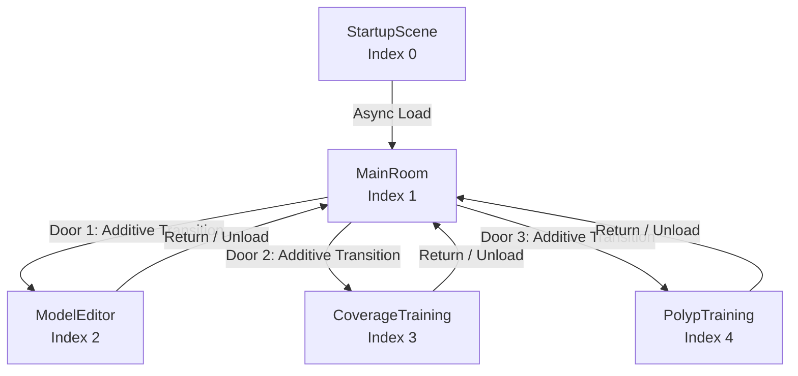
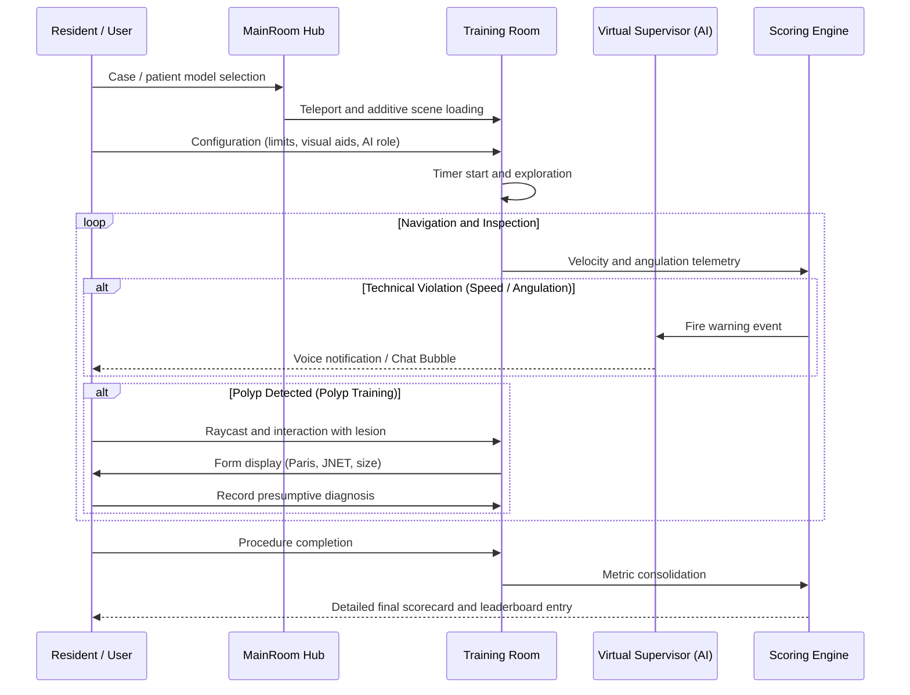

# LoGiViT — Architecture and Project Structure Overview

**Lower Gastrointestinal Virtual Training (LoGiViT)** is an advanced medical simulation platform in **Virtual Reality (VR)**, designed for the clinical training of **diagnostic and interventional colonoscopy** procedures.

The system integrates procedural anatomical generation of the intestinal tract, optical inspection with virtual and physical endoscopes, diagnostic detection and classification of pathologies according to international standards (Paris and JNET), hardware-accelerated real-time mucosal coverage analysis, and an interactive virtual supervisor guided by Large Language Models (LLM) and text-to-speech (TTS) synthesis.

---

## 1. Technical Specifications

| Parameter | Detail |
| :--- | :--- |
| **Game Engine** | Unity 6000.4.0f1 (Unity 6.4) |
| **Render Pipeline** | High Definition Render Pipeline (HDRP 17.4.0) |
| **Target Platforms** | Windows PC (Exclusive to Virtual Reality via OpenXR) |
| **XR Integration** | Unity XR Interaction Toolkit 3.4.0, Unity XR Hands 1.7.3, OpenXR 1.16.1 |
| **Physical Input / Hardware** | Serial RS-232/USB communication ([SerialUSB.cs](Assets/Scripts/SerialUSB.cs)) for physical simulation endoscopes |
| **Artificial Intelligence** | Local (Ollama: any model such as Llama 3.2, Mistral, BioMistral, Phi), Cloud (OpenAI GPT-4o-mini, Whisper, TTS-1) and Google Cloud Text-to-Speech |
| **Localization** | Unity Localization 1.5.8 (multilingual support for UI texts and assistant voices) |

---

## 2. Scene Map and Application Lifecycle

The build order and scene indices are configured in [EditorBuildSettings.asset](ProjectSettings/EditorBuildSettings.asset):

```
Build Index:
  [0] StartupScene        -> Persistent initialization and bootstrap
  [1] MainRoom            -> Central hospital hub and session selection
  [2] ModelEditor         -> Studio for colon parameterization and procedural generation
  [3] CoverageTraining    -> Mucosal coverage training module
  [4] PolypTraining       -> Polyp detection and diagnostic training module
(Outside Build):
  [-] RecordingRoom       -> Technical scene for thumbnail rendering and dataset capture
```



### 2.1. `StartupScene.unity` (Index 0)
- **Purpose:** Initialization of the global ecosystem.
- **Key Components:**
  - [ApplicationManager.cs](Assets/Scripts/Scenes/StartupScene/ApplicationManager.cs): Persistent `DontDestroyOnLoad` singleton with `[DefaultExecutionOrder(-100)]`. Coordinates global settings, the active colonic model (`_currentModel`), and the initialization of [FileManager.cs](Assets/Scripts/FileManagement/FileManager.cs).
  - [SceneFlowController.cs](Assets/Scripts/Scenes/StartupScene/SceneFlowController.cs): Persistent singleton managing the stack of additively loaded scenes, loading modal displays, and the injection of teleport providers and XR controller interfaces.
  - [AppSettingsController.cs](Assets/Scripts/Scenes/StartupScene/AppSettingsController.cs): HDRP graphics configuration, audio volume, API keys, and interaction settings.

### 2.2. `MainRoom.unity` (Index 1)
- **Purpose:** Hospital consultation room / anteroom acting as the user's command center.
- **Key Components:**
  - [MainRoomManager.cs](Assets/Scripts/Scenes/MainRoom/MainRoomManager.cs): Manages the state of the main room and initial interaction.
  - [ColonoscopyRoomsTransitionController.cs](Assets/Scripts/Scenes/MainRoom/ColonoscopyRoomsTransitionController.cs): Coordinates the opening and closing of interactive doors ([PracticableDoorsController.cs](Assets/Scripts/Scenes/MainRoom/PracticableDoorsController.cs)) and user teleportation between the hub and secondary training or editing rooms.
  - [ModelFileBrowserController.cs](Assets/Scripts/Scenes/MainRoom/ModelFileBrowserController.cs): Allows selecting patient models saved on disk or loaded from `StreamingAssets`.

### 2.3. `ModelEditor.unity` (Index 2)
- **Purpose:** Three-dimensional studio to author, manipulate, and export large intestine models.
- **Key Components:**
  - [ModelEditorManager.cs](Assets/Scripts/Scenes/ModelEditor/ModelEditorManager.cs): Primary orchestrator with priority execution `[DefaultExecutionOrder(-200)]`. Implements the Mediator pattern and coordinates five editing mode controllers:
    1. **Tract ([TractEditionModeController.cs](Assets/Scripts/Scenes/ModelEditor/EditionModes/TractEditionModeController.cs)):** Direct manipulation of 3D spline nodes via XR grab handles.
    2. **Presets ([PresetEditionModeController.cs](Assets/Scripts/Scenes/ModelEditor/EditionModes/PresetEditionModeController.cs)):** Saving, loading, and cloning anatomical profiles and curves.
    3. **Details ([DetailsEditionModeController.cs](Assets/Scripts/Scenes/ModelEditor/EditionModes/DetailsEditionModeController.cs)):** Modification of haustra and colonic caliber via *blendshapes*.
    4. **Diseases ([DiseaseEditionModeController.cs](Assets/Scripts/Scenes/ModelEditor/EditionModes/DiseaseEditionModeController.cs)):** Three-dimensional placement and projection of polyps onto internal luminal walls.
    5. **Preview ([PreviewEditionModeController.cs](Assets/Scripts/Scenes/ModelEditor/EditionModes/PreviewEditionModeController.cs)):** Free navigation inside the generated colon lumen.

### 2.4. `CoverageTraining.unity` (Index 3)
- **Purpose:** Clinical session to train endoscopic withdrawal and evaluate what percentage of the mucosa was thoroughly visualized.
- **Key Components:**
  - [CoverageTrainingManager.cs](Assets/Scripts/Scenes/CoverageTraining/CoverageTrainingManager.cs): Manages training lifecycle, timing, and final score calculation.
  - [NewCameraCoverage.cs](Assets/Scripts/Scenes/CoverageTraining/NewCameraCoverage.cs): Surface coverage tracking accelerated via Unity Jobs and the Burst Compiler.
  - [CoverageTrainingRankingPolicy.cs](Assets/Scripts/Scenes/CoverageTraining/CoverageTrainingRankingPolicy.cs): Scoring rules based on total coverage, section-by-section coverage (rectum, sigmoid, descending, transverse, ascending, cecum), and deductions for excessive withdrawal speed or abrupt angulation.

### 2.5. `PolypTraining.unity` (Index 4)
- **Purpose:** Detection of colonic lesions and virtual morphological/histological classification.
- **Key Components:**
  - [PolypTrainingManager.cs](Assets/Scripts/Scenes/PolypTraining/PolypTrainingManager.cs): Orchestrates the interventional training session.
  - [PolypDetectionController.cs](Assets/Scripts/Scenes/PolypTraining/PolypDetectionController.cs): Detects when the trainee focuses on and selects a polyp within the colonic lumen.
  - [PolypIdentificationController.cs](Assets/Scripts/Scenes/PolypTraining/PolypIdentificationController.cs): Displays an interactive clinical form where the resident evaluates:
    - **Morphology (Paris Classification):** Pedunculated polypoid (`0-Ip`), sessile polypoid (`0-Is`), flat elevated (`0-IIa`), flat superficial (`0-IIb`), slightly depressed (`0-IIc`), or excavated (`0-III`).
    - **Microvascular/Mucosal Pattern (JNET Classification):** Type 1 (hyperplastic), Type 2A (low-grade adenoma), Type 2B (high-grade adenoma / superficial carcinoma), Type 3 (deep invasive carcinoma).
    - **Estimated Size:** In millimeters, contrasted against dynamically generated stochastic distractors.
    - **Colonic Segment:** Accurate anatomical location.

### 2.6. `RecordingRoom.unity` (Technical Utility)
- **Purpose:** Automation of screenshots, orbital 3D model rotation, and thumbnail view generation ([ModelPreviewRecorder.cs](Assets/Scripts/ModelPreviewRecorder.cs)).

---

## 3. Subsystems and Code Architecture (`Assets/Scripts/`)

The LoGiViT source code follows a decoupled, event-driven, modular architecture with dependency inversion and low-level optimizations for real-time rendering in HDRP and Virtual Reality.

Below is the complete structure of **all subfolders** within [Assets/Scripts](Assets/Scripts):

```
Assets/Scripts/
├── Common/            # Computational geometry, 3D algebra, mesh utilities, and algorithms
├── CustomUI/          # Complete 3D and 2D spatial UI system adapted for XR and Desktop
├── Diseases/          # Clinical definitions, morphology, and catalog of pathologies/polyps
├── Endoscope/         # Rigid-body dynamics, camera optics, and endoscope navigation
├── FileManagement/    # File system, I/O persistence, encryption, and export formats
├── Input/             # Logical and visual XR controller mappings (Meta Quest, HTC Vive)
├── LargeIntestine/    # Anatomical definition, profile generators, haustra
├── Messages/          # Decoupled notification, event, and alert system
├── Scenes/            # Scene-specific controllers and shared cross-scene modules
│   ├── StartupScene/      # Persistent initialization and global bootstrap
│   ├── MainRoom/          # Hospital hub, practicable doors, and transitions
│   ├── ModelEditor/       # Procedural colon studio and editing modes
│   ├── CoverageTraining/  # Mucosal coverage measurement and scoring
│   ├── PolypTraining/     # Clinical polyp detection and diagnosis
│   └── SceneCommons/      # AI (Ollama/OpenAI), audio, shared endoscope, and HUD
├── Serialization/     # Custom Newtonsoft JSON converters for geometry and state
├── Tests/             # Metric measurement tools and mesh welding tests
├── UVComputing/       # Cylindrical UV unwrapping, normal correction, and Blender pipeline
└── VRTemplateAssets/  # Auxiliary XR kinematic and haptic interaction components
```

---

### 3.1. `Common/`: Computational Geometry, Algorithms, and Mesh Utilities

This folder is the mathematical core of the project. It contains a low-level computational geometry library written in C# to solve topology problems, normal calculation, and mesh manipulation without external black boxes.

#### Subfolders inside `Common/`:
- **`GeometryUtils/`**:
  - [MeshData.cs](Assets/Scripts/Common/GeometryUtils/MeshData.cs) and [MeshDataStructures.cs](Assets/Scripts/Common/GeometryUtils/MeshDataStructures.cs): Decoupled containers for vertices, triangles, normals, tangents, and UVs optimized for in-memory manipulation without overloading the Unity API.
  - [BlendshapeNormalFixer.cs](Assets/Scripts/Common/GeometryUtils/BlendshapeNormalFixer.cs): Fixes shading artifacts and inverted normals when deforming the colon via *blendshapes*.
  - [EditorMeshUtils.cs](Assets/Scripts/Common/GeometryUtils/EditorMeshUtils.cs) and [MeshUtility.cs](Assets/Scripts/Common/GeometryUtils/MeshUtility.cs): Utility functions for deep copying, spatial transformation, and reversing mesh winding order.
- **`Utilities/`**:
  - [ImprovedMeshWeld.cs](Assets/Scripts/Common/Utilities/ImprovedMeshWeld.cs) and [NewWelder.cs](Assets/Scripts/Common/Utilities/NewWelder.cs): Coincident vertex welding algorithms by metric proximity (`_weldingPosThreshold`) using *spatial hashing* to reduce time complexity to $O(N)$.
  - [NormalSolver.cs](Assets/Scripts/Common/Utilities/NormalSolver.cs): Recalculation of face-angle-weighted normals for seam smoothing.
  - [CameraUtils.cs](Assets/Scripts/Common/Utilities/CameraUtils.cs) and [CameraLightsMasking.cs](Assets/Scripts/Common/Utilities/CameraLightsMasking.cs): Handling of lighting masks and culling layers for the endoscope camera in HDRP.
  - [Debugger.cs](Assets/Scripts/Common/Utilities/Debugger.cs) and [FPSCounter.cs](Assets/Scripts/Common/Utilities/FPSCounter.cs): Call tracing and performance monitoring on XR headsets.
  - [ObjLoaderFromFile.cs](Assets/Scripts/Common/Utilities/ObjLoaderFromFile.cs): Runtime hot-loader for Wavefront OBJ meshes.
- **`DelaunayTriangulation/`**:
  - Complete 2D and 3D Delaunay triangulation implementations ([DelaunayTriangulation.cs](Assets/Scripts/Common/DelaunayTriangulation/DelaunayTriangulation.cs), [DelaunayTriangle.cs](Assets/Scripts/Common/DelaunayTriangulation/DelaunayTriangle.cs), [PointBinGrid.cs](Assets/Scripts/Common/DelaunayTriangulation/PointBinGrid.cs)) for reconstructing cross-sections and end caps of the colon.
- **`BaseClasses/`**:
  - [BlendVertex.cs](Assets/Scripts/Common/BaseClasses/BlendVertex.cs): Struct representing vertices undergoing interpolation between base meshes and blendshape deltas.
- **`UnityEditor/`**:
  - [MeshCombinerWindow.cs](Assets/Scripts/Common/UnityEditor/MeshCombinerWindow.cs): Editor window tool for merging meshes at design time.
  - [PolypAssetCreatorWindow.cs](Assets/Scripts/Common/UnityEditor/PolypAssetCreatorWindow.cs): Wizard for creating and indexing pathology prefabs.
  - [SkinnedMeshRendererContextMenu.cs](Assets/Scripts/Common/UnityEditor/SkinnedMeshRendererContextMenu.cs): Inspector shortcuts for mesh inspection.
- **Numerical Computational Geometry Modules (`1.` through `9.` and `Data structures/`)**:
  - **Intersections and Convex Hulls:** 2D Quickhull and Jarvis March envelopes ([QuickhullAlgorithm2D.cs](Assets/Scripts/Common/3.%20Convex%20Hull/2d/QuickhullAlgorithm2D.cs), [JarvisMarchAlgorithm2D.cs](Assets/Scripts/Common/3.%20Convex%20Hull/2d/JarvisMarchAlgorithm2D.cs)), and iterative 3D algorithms.
  - **Triangulation and Clipping:** Ear Clipping algorithms with hole detection, Marching Squares for tissue contouring, and Greiner-Hormann / Sutherland-Hodgman polygon clipping.
  - **Voronoi Diagrams:** Generation from dual Delaunay triangulations ([Voronoi.cs](Assets/Scripts/Common/5.%20Voronoi%20diagram/Voronoi.cs)).
  - **Curve Extrusion:** Cylindrical tubular mesh extrusion along cubic Bézier and Catmull-Rom curves ([ExtrudeMeshAlongCurve.cs](Assets/Scripts/Common/7.%20Extrude%20mesh%20along%20curve/Extrude%20mesh/ExtrudeMeshAlongCurve.cs)).
  - **Simplification (Decimation):** Mesh optimization module based on the **Quadric Error Metric (QEM)** ([MeshSimplification_QEM.cs](Assets/Scripts/Common/Quadric%20Error%20Metric/MeshSimplification_QEM.cs)).
  - **Topological Data Structures:** Half-edge data structure ([HalfEdgeData3.cs](Assets/Scripts/Common/Data%20structures/Half-edge/HalfEdgeData3.cs)) for edge adjacency queries and binary heaps ([Heap.cs](Assets/Scripts/Common/Data%20structures/Heap/Heap.cs)).
- **`Common/` Root Scripts**:
  - [GameObjectFactory.cs](Assets/Scripts/Common/GameObjectFactory.cs): Factory for standardized instantiation of primitives and rigs.
  - [LocaleController.cs](Assets/Scripts/Common/LocaleController.cs) and [CustomLocalizeStringEvent.cs](Assets/Scripts/Common/CustomLocalizeStringEvent.cs): Bridge to Unity Localization for runtime string refreshing.
  - [PerCameraLightExcluder.cs](Assets/Scripts/Common/PerCameraLightExcluder.cs): Selectively disables environmental light sources when rendering the internal endoscopic view.
  - [MeshDifference.cs](Assets/Scripts/Common/MeshDifference.cs), [MeshDimesions.cs](Assets/Scripts/Common/MeshDimesions.cs), [MeshRotator.cs](Assets/Scripts/Common/MeshRotator.cs), and [UnsafeCopy.cs](Assets/Scripts/Common/UnsafeCopy.cs).

---

### 3.2. `CustomUI/`: 3D Interface System and Spatial Ergonomics

This subsystem implements three-dimensional user interfaces adapted for direct physical interaction with Virtual Reality controllers (laser pointers and *direct touch*) as well as mouse input in desktop mode.

- **Core Interactive Components:**
  - [RadialSliderController.cs](Assets/Scripts/CustomUI/RadialSliderController.cs): 3D radial slider with grab-and-twist continuous angular input.
  - [ResponsiveInteractiveElement.cs](Assets/Scripts/CustomUI/ResponsiveInteractiveElement.cs): Base class managing *Hover*, *Press*, *Select* states alongside audio and haptic feedback.
  - [SliderController.cs](Assets/Scripts/CustomUI/SliderController.cs), [SwitchController.cs](Assets/Scripts/CustomUI/SwitchController.cs), [ToggleController.cs](Assets/Scripts/CustomUI/ToggleController.cs), [ButtonController.cs](Assets/Scripts/CustomUI/ButtonController.cs), and [InputFieldController.cs](Assets/Scripts/CustomUI/InputFieldController.cs).
  - [ModalView.cs](Assets/Scripts/CustomUI/ModalView.cs) and [ModalConfig.cs](Assets/Scripts/CustomUI/ModalConfig.cs): Three-dimensional modal dialog boxes (confirmations, warnings, and blocking loading screens).
  - [ChatBubble.cs](Assets/Scripts/CustomUI/ChatBubble.cs): Comic-style 3D speech bubble component for the AI assistant.
- **Three-Dimensional Scroll Areas:**
  - [BaseScrollArea.cs](Assets/Scripts/CustomUI/BaseScrollArea.cs) and [FilterableScrollArea.cs](Assets/Scripts/CustomUI/FilterableScrollArea.cs): XR-adapted scroll container with dynamic filtering and smooth auto-scrolling ([ScrollAreaAutoScroller.cs](Assets/Scripts/CustomUI/ScrollAreaAutoScroller.cs)).
  - Specialized implementations: [DiseaseScrollArea.cs](Assets/Scripts/CustomUI/DiseaseScrollArea.cs) (pathology catalog), [ModelScrollArea.cs](Assets/Scripts/CustomUI/ModelScrollArea.cs) (patient model browser), and [SplinePresetScrollArea.cs](Assets/Scripts/CustomUI/SplinePresetScrollArea.cs) (spline presets).
- **Kinematics and Micro-interactions:**
  - [HoverSwayEffect.cs](Assets/Scripts/CustomUI/HoverSwayEffect.cs): Subtle user-facing sway when pointing at a panel.
  - [HoverGroupController.cs](Assets/Scripts/CustomUI/HoverGroupController.cs) and [SlideEffect.cs](Assets/Scripts/CustomUI/SlideEffect.cs): Animated transitions for menu entrance.
- **XR Interaction and Specialized Grabbing:**
  - [MovementAxisLockGrabTransformer.cs](Assets/Scripts/CustomUI/MovementAxisLockGrabTransformer.cs): Constrains interactable motion to specific axes when handled with the XR controller.
  - [XRIntestineSectionInteractable.cs](Assets/Scripts/CustomUI/XRIntestineSectionInteractable.cs) and [XRSplineNodeInteractable.cs](Assets/Scripts/CustomUI/XRSplineNodeInteractable.cs): XR Interaction Toolkit objects to select and move anatomical sections or curve nodes in 3D space.
  - [XRTeleportDestinationProvider.cs](Assets/Scripts/CustomUI/XRTeleportDestinationProvider.cs): Provider that assigns and updates active teleport anchors when changing rooms.
- **Interfaces:**
  - [IClickable](Assets/Scripts/CustomUI/Interfaces/IClickable.cs), [IHoverable](Assets/Scripts/CustomUI/Interfaces/IHoverable.cs), [IInteractableElement](Assets/Scripts/CustomUI/Interfaces/IInteractableElement.cs), [IOutlineInteractable](Assets/Scripts/CustomUI/Interfaces/IOutlineInteractable.cs), and [ISelectable](Assets/Scripts/CustomUI/Interfaces/ISelectable.cs).

---

### 3.3. `Diseases/`: Colorectal Pathology and Clinical Profiles

Module dedicated to the medical and morphological representation of lesions:

- [Polyp.cs](Assets/Scripts/Diseases/Polyp.cs): Data model storing clinical properties of a specific lesion:
  - Paris Classification (`0-Ip`, `0-Is`, `0-IIa`, `0-IIb`, `0-IIc`, `0-III`).
  - JNET Classification (`Type 1`, `Type 2A`, `Type 2B`, `Type 3`).
  - Real metric size in millimeters and location in the colon (cecum to rectum).
  - Unique identifier, material, and associated mesh.
- [PolypProfile.cs](Assets/Scripts/Diseases/PolypProfile.cs): `ScriptableObject` encapsulating visual and parametric pathology configurations for selection in the editor or stochastic generation.
- [PolypProfileCatalog.cs](Assets/Scripts/Diseases/PolypProfileCatalog.cs): Central indexed registry of all polyp profiles available in the project.

---

### 3.4. `Endoscope/`: Physical Dynamics and Optics of the Endoscope

Controls the endoscopic instrument in both its visual and kinematic aspects:

- [Endoscope.cs](Assets/Scripts/Endoscope/Endoscope.cs): Singleton managing endoscope physics:
  - Array of `Rigidbody` components simulating stiffness and resistance along the flexible shaft and bending section segments.
  - Endoscopic optical camera with field of view (FOV) limit controls.
  - Camera modes (`Center`, `PositiveAngulation`, `NegativeAngulation`, `PositiveDisplacement`, `NegativeDisplacement`) and angular limiters replicating the behavior of handle deflection wheels.
- [EndoscopeSpline.cs](Assets/Scripts/Endoscope/EndoscopeSpline.cs): Binds the position and rotation of the camera tip to the colon spline curve, enabling continuous advancement and withdrawal along the lumen.

---

### 3.5. `FileManagement/`: Persistence, Encryption, and I/O Formats

Manages loading and saving anatomical models, classifications, and training sessions:

- [FileManager.cs](Assets/Scripts/FileManagement/FileManager.cs): Static I/O class managing storage paths across the system:
  - Loading and saving patient models in `Application.persistentDataPath` and factory presets in `StreamingAssets/DefaultFiles/`.
  - Ranking history and clinical performance metrics.
- [FileDecryptor.cs](Assets/Scripts/FileManagement/FileDecryptor.cs): Cryptographic security layer to obfuscate and verify data integrity of model files and clinical results.
- [Model.cs](Assets/Scripts/FileManagement/Model.cs): Data Transfer Object encapsulating a patient's complete definition: file path, base spline, blendshape weights, haustral noise, and assigned pathology list.
- [ModelMeshIO.cs](Assets/Scripts/FileManagement/ModelMeshIO.cs): 3D geometry import and export in open Wavefront OBJ and Autodesk FBX formats.
- [Disease.cs](Assets/Scripts/FileManagement/Disease.cs): Serializable struct storing pathological metadata tied to a model file.
- [NoiseSettings.cs](Assets/Scripts/FileManagement/NoiseSettings.cs) and [JsonData.cs](Assets/Scripts/FileManagement/JsonData.cs): Serialized stochastic deformation parameters.

---

### 3.6. `Input/`: Control Abstraction and VR Mapping

Ensures that the simulator operates transparently across various Virtual Reality headsets and controllers:

- **Subfolder `Input/XR/`**:
  - [XRControllerLogicalBinding.cs](Assets/Scripts/Input/XR/XRControllerLogicalBinding.cs): Semantic mapping binding logical simulation actions (e.g., "Angulate Up", "Advance", "Detect Polyp", "Toggle UI") to physical controller buttons.
  - [XRControllerKeybindProfile.cs](Assets/Scripts/Input/XR/XRControllerKeybindProfile.cs), [LeftControllerKeybindProfile.cs](Assets/Scripts/Input/XR/LeftControllerKeybindProfile.cs), and [RightControllerKeybindProfile.cs](Assets/Scripts/Input/XR/RightControllerKeybindProfile.cs): `ScriptableObject` profiles defining button layouts for Meta Quest or HTC Vive controllers.
  - [XRKeybindDisplayProfileView.cs](Assets/Scripts/Input/XR/XRKeybindDisplayProfileView.cs): Generates floating 3D labels over physical buttons in Virtual Reality, guiding the user on active button functions per scene.
  - [IXRKeybindDisplayProfileProvider.cs](Assets/Scripts/Input/XR/IXRKeybindDisplayProfileProvider.cs): Interface allowing each secondary room to inform `SceneFlowController` of its active controls.
  - [IXRViveDPadInteractor.cs](Assets/Scripts/Input/XR/IXRViveDPadInteractor.cs): Specialized controller for the HTC Vive touch trackpad.

---

### 3.7. `LargeIntestine/`: Anatomical Definition of the Colon

Manages the medical and morphological structure of the large intestine:

- [LI_Structure.cs](Assets/Scripts/LargeIntestine/LI_Structure.cs): Formal enumeration and metadata for colon sections:
  - Rectum, Sigmoid Colon, Descending Colon, Splenic Flexure, Transverse Colon, Hepatic Flexure, Ascending Colon, and Cecum.
- [LI_GenerationConfiguration.cs](Assets/Scripts/LargeIntestine/LI_GenerationConfiguration.cs): Master `ScriptableObject` defining minimum/maximum radii per section, subdivision count, haustra densities, and noise configurations.
- [LI_ConfigurationValidator.cs](Assets/Scripts/LargeIntestine/LI_ConfigurationValidator.cs): Mathematically verifies that the spline generates neither self-intersecting colon geometry nor curvature impossible for an endoscope to negotiate.
- [LI_BlendshapePreset.cs](Assets/Scripts/LargeIntestine/LI_BlendshapePreset.cs): Precomputed muscle tone and haustral contraction presets.
- [SplineMeshProfile.cs](Assets/Scripts/LargeIntestine/SplineMeshProfile.cs) and [SplineMeshProfileCatalog.cs](Assets/Scripts/LargeIntestine/SplineMeshProfileCatalog.cs): Define cross-sectional profile shapes extruded along the trajectory.
- **Subfolder `LargeIntestine/Editor/`**:
  - [LI_ConfigurationBuilderWindow.cs](Assets/Scripts/LargeIntestine/Editor/LI_ConfigurationBuilderWindow.cs): In-editor authoring window to design anatomical profiles and export `.ligc` configurations.
  - [SplineMeshProfileGenerator.cs](Assets/Scripts/LargeIntestine/Editor/SplineMeshProfileGenerator.cs) and [SplineMeshProfileEditor.cs](Assets/Scripts/LargeIntestine/Editor/SplineMeshProfileEditor.cs): Interactive profile geometry editing tools.

---

### 3.8. `Messages/`: Decoupled Notification and Event System

- [MessageController.cs](Assets/Scripts/Messages/MessageController.cs): Dispatches notifications and alerts to the user. Allows any component to fire clinical or status warnings without coupling to the active UI.
- [MessageStrings.cs](Assets/Scripts/Messages/MessageStrings.cs): Catalog of string constants and localization keys for system messages.

---

### 3.9. `Scenes/`: Scene-Specific Controllers

The largest functional area of the project, organized into five scene subdirectories and one cross-cutting shared module:

#### 3.9.1. `Scenes/StartupScene/`
- [ApplicationManager.cs](Assets/Scripts/Scenes/StartupScene/ApplicationManager.cs): Global lifecycle coordinator (`[DefaultExecutionOrder(-100)]`), maintains references to the active patient model and manages data encryption.
- [SceneFlowController.cs](Assets/Scripts/Scenes/StartupScene/SceneFlowController.cs): Persistent singleton executing asynchronous additive scene loading, splash screen management, and wiring XR interactables to scene providers.
- [AppSettingsController.cs](Assets/Scripts/Scenes/StartupScene/AppSettingsController.cs) and [AppSettings.cs](Assets/Scripts/Scenes/StartupScene/AppSettings.cs): Stores and applies HDRP visual quality settings, audio preferences, and API keys.
- [AudioManager.cs](Assets/Scripts/Scenes/StartupScene/AudioManager.cs): Centralized sound effects, button audio feedback, and master volume control.

#### 3.9.2. `Scenes/MainRoom/`
- [MainRoomManager.cs](Assets/Scripts/Scenes/MainRoom/MainRoomManager.cs): Manages the state of the main hospital consultation hub.
- [ColonoscopyRoomsTransitionController.cs](Assets/Scripts/Scenes/MainRoom/ColonoscopyRoomsTransitionController.cs): Coordinates the enter/exit lifecycle between the main room and secondary suites (`ModelEditor`, `CoverageTraining`, `PolypTraining`), controlling door animations and teleportation.
- [PracticableDoorsController.cs](Assets/Scripts/Scenes/MainRoom/PracticableDoorsController.cs) and [DoorTriggerZone.cs](Assets/Scripts/Scenes/MainRoom/DoorTriggerZone.cs): Controls interactive automated doors opening into virtual operating rooms.
- [ModelFileBrowserController.cs](Assets/Scripts/Scenes/MainRoom/ModelFileBrowserController.cs): Search, filter, and select colon models stored on disk for the current session.

#### 3.9.3. `Scenes/ModelEditor/`
Coordinates procedural editing and parameterization of intestinal models:
- **Core Controllers:**
  - [ModelEditorManager.cs](Assets/Scripts/Scenes/ModelEditor/ModelEditorManager.cs): Orchestrator with `[DefaultExecutionOrder(-200)]`. Applies the Mediator pattern between editing modes and feature controllers.
  - [LargeIntestineModelGenerator.cs](Assets/Scripts/Scenes/ModelEditor/LargeIntestineModelGenerator.cs): Generates the 3D mesh via spline extrusion, supporting segmented models (for editing) and welded models (for training).
  - [LI_MeshWelder.cs](Assets/Scripts/Scenes/ModelEditor/LI_MeshWelder.cs): Seamless welding of colon segments while preserving blendshape normal deltas.
  - [DiseasePlacementController.cs](Assets/Scripts/Scenes/ModelEditor/DiseasePlacementController.cs) and [DiseaseMeshMerger.cs](Assets/Scripts/Scenes/ModelEditor/DiseaseMeshMerger.cs): Interactive 3D placement of polyps and geometric fusion into colonic mesh.
  - [BlendshapesController.cs](Assets/Scripts/Scenes/ModelEditor/BlendshapesController.cs), [BlendshapeSliderPanel.cs](Assets/Scripts/Scenes/ModelEditor/BlendshapeSliderPanel.cs), and [DynamicBlendshapeSliderController.cs](Assets/Scripts/Scenes/ModelEditor/DynamicBlendshapeSliderController.cs): Real-time modification of haustra and deformations using 3D sliders.
  - [SplinePresetsController.cs](Assets/Scripts/Scenes/ModelEditor/SplinePresetsController.cs): Load, save, and clone spline curves with undo/redo support.
  - [SplineNodeInteractablesController.cs](Assets/Scripts/Scenes/ModelEditor/SplineNodeInteractablesController.cs): XR interaction controllers to manipulate curve nodes directly with controllers.
- **Procedural Anatomical Loops:**
  - [BaseLoop.cs](Assets/Scripts/Scenes/ModelEditor/BaseLoop.cs): Mathematical base class for curve loop deformations.
  - [AlphaLoop.cs](Assets/Scripts/Scenes/ModelEditor/AlphaLoop.cs), [ReversedAlphaLoop.cs](Assets/Scripts/Scenes/ModelEditor/ReversedAlphaLoop.cs), [GammaLoop.cs](Assets/Scripts/Scenes/ModelEditor/GammaLoop.cs), [NLoop.cs](Assets/Scripts/Scenes/ModelEditor/NLoop.cs), and [TransverseLoop.cs](Assets/Scripts/Scenes/ModelEditor/TransverseLoop.cs): Trigonometric formulas generating colonic loops with anatomical precision.
  - [LoopGenerationJobs.cs](Assets/Scripts/Scenes/ModelEditor/LoopGenerationJobs.cs): C# Job-parallelized loop position calculations.
- **Subfolder `EditionModes/`:**
  - State pattern implementation via pure C# classes: [TractEditionModeController.cs](Assets/Scripts/Scenes/ModelEditor/EditionModes/TractEditionModeController.cs), [PresetEditionModeController.cs](Assets/Scripts/Scenes/ModelEditor/EditionModes/PresetEditionModeController.cs), [DetailsEditionModeController.cs](Assets/Scripts/Scenes/ModelEditor/EditionModes/DetailsEditionModeController.cs), [DiseaseEditionModeController.cs](Assets/Scripts/Scenes/ModelEditor/EditionModes/DiseaseEditionModeController.cs), and [PreviewEditionModeController.cs](Assets/Scripts/Scenes/ModelEditor/EditionModes/PreviewEditionModeController.cs).
- **Subfolder `Interfaces/`:**
  - Inversion-of-control interfaces decoupling the editor: [ISplineModelGenerator](Assets/Scripts/Scenes/ModelEditor/Interfaces/ISplineModelGenerator.cs), [IBlendshapesController](Assets/Scripts/Scenes/ModelEditor/Interfaces/IBlendshapesController.cs), [IModelEditorStateProvider](Assets/Scripts/Scenes/ModelEditor/Interfaces/IModelEditorStateProvider.cs), [ISplinePresetsController](Assets/Scripts/Scenes/ModelEditor/Interfaces/ISplinePresetsController.cs), etc.

#### 3.9.4. `Scenes/CoverageTraining/`
- [CoverageTrainingManager.cs](Assets/Scripts/Scenes/CoverageTraining/CoverageTrainingManager.cs): Central manager for mucosal withdrawal training. Handles timers, pause states, speed penalty calculation, and score consolidation.
- [NewCameraCoverage.cs](Assets/Scripts/Scenes/CoverageTraining/NewCameraCoverage.cs): Burst Compiler and C# Job-accelerated mucosal coverage tracker:
  - Uses a circular conical model (`focusConeAngle = 30°`) and normal angle test (`visionAngle = 65°`).
  - Dispatches parallel batches of `RaycastCommand` to exclude triangles occluded by intervening haustral folds.
  - Accumulates continuous observation time and updates the HDRP visual overlay mesh via a 256-color LUT gradient.
- [CoverageTrainingRankingPolicy.cs](Assets/Scripts/Scenes/CoverageTraining/CoverageTrainingRankingPolicy.cs): Scoring policy weighting global coverage (70%) and anatomical sections (30%), with deductions for excessive withdrawal speed.
- [CoverageTrainingScreenHudView.cs](Assets/Scripts/Scenes/CoverageTraining/CoverageTrainingScreenHudView.cs) and [CoverageTrainingScreenHudDataSnapshot.cs](Assets/Scripts/Scenes/CoverageTraining/CoverageTrainingScreenHudDataSnapshot.cs): Virtual HUD showing real-time section-by-section coverage breakdowns.

#### 3.9.5. `Scenes/PolypTraining/`
- [PolypTrainingManager.cs](Assets/Scripts/Scenes/PolypTraining/PolypTrainingManager.cs): Pathology detection training orchestrator. Coordinates the workflow: navigation $\rightarrow$ interactive detection $\rightarrow$ pause and characterization $\rightarrow$ resume $\rightarrow$ final scorecard.
- [PolypDetectionController.cs](Assets/Scripts/Scenes/PolypTraining/PolypDetectionController.cs) and [XRPolypInteractable.cs](Assets/Scripts/Scenes/PolypTraining/XRPolypInteractable.cs): Detects when the trainee targets or interacts with a luminal lesion via raycast.
- [PolypIdentificationController.cs](Assets/Scripts/Scenes/PolypTraining/PolypIdentificationController.cs): Manages the queue of detected lesions and scores the trainee's clinical answers:
  - Score breakdown: Anatomical location (25%), Paris morphological classification (25%), JNET virtual histological classification (25%), and metric size estimation (25%).
  - Generation of realistic random distractors ($\pm 1\text{ mm}$, rounded to $0.5\text{ mm}$).
- [PolypIdentificationAnswer.cs](Assets/Scripts/Scenes/PolypTraining/PolypIdentificationAnswer.cs) and [PolypIdentificationSnapshot.cs](Assets/Scripts/Scenes/PolypTraining/PolypIdentificationSnapshot.cs): Immutable records storing student correct answers, deviations, and response times.
- [PolypTrainingRankingPolicy.cs](Assets/Scripts/Scenes/PolypTraining/PolypTrainingRankingPolicy.cs): Final grading formula based on global detection rate and mean diagnostic accuracy.

#### 3.9.6. `Scenes/SceneCommons/` (Shared Modules)
Subsystems shared across all scenes:
- **Artificial Intelligence and Audio:**
  - [OllamaClient.cs](Assets/Scripts/Scenes/SceneCommons/OllamaClient.cs): Asynchronous REST HTTP client to communicate with a local Ollama server (compatible with any downloaded model, defaults to `llama3.2`).
  - [OpenAIAudioClient.cs](Assets/Scripts/Scenes/SceneCommons/OpenAIAudioClient.cs): Cloud client for ChatGPT (`gpt-4o-mini`), Whisper (`whisper-1` for STT), and OpenAI TTS (`tts-1`). Includes *Tool Calling* support (`SendLLMRequestWithTools`).
  - [AIPromptsHelper.cs](Assets/Scripts/Scenes/SceneCommons/AIPromtpsHelper.cs): Catalog of system prompts (*Helper* and *Supervisor* roles) and clinical warning prompts (speed violations levels 1, 2, 3, harsh angulation, cecum reached, etc.).
  - [LLMToolsConfig.cs](Assets/Scripts/Scenes/SceneCommons/LLMToolsConfig.cs): `ScriptableObject` containing JSON tool specifications allowing the AI to invoke simulator actions via trainee voice commands.
  - [AudioRecorder.cs](Assets/Scripts/Scenes/SceneCommons/AudioRecorder.cs), [WavUtil.cs](Assets/Scripts/Scenes/SceneCommons/WavUtil.cs), and [WavUtility.cs](Assets/Scripts/Scenes/SceneCommons/WavUtility.cs): Microphone audio capture and PCM/WAV encoding for STT.
  - [ChatBubbleSpawner.cs](Assets/Scripts/Scenes/SceneCommons/ChatBubbleSpawner.cs): Spawns floating 3D bubbles in VR oriented toward the user.
- **Endoscope and Navigation:**
  - [GrowingEndoscope.cs](Assets/Scripts/Scenes/SceneCommons/GrowingEndoscope.cs) and [GrowingSplineEndoscope.cs](Assets/Scripts/Scenes/SceneCommons/GrowingSplineEndoscope.cs): Procedural shaft mesh extrusion as the scope inserts into the patient.
  - [SimpleSplineNavigator.cs](Assets/Scripts/Scenes/SceneCommons/SimpleSplineNavigator.cs) and [VRSimpleSplineNavigator.cs](Assets/Scripts/Scenes/SceneCommons/VRSimpleSplineNavigator.cs): Kinematic translation and rotation logic along the central colon curve.
  - [VRArticulationGrabFollow.cs](Assets/Scripts/Scenes/SceneCommons/VRArticulationGrabFollow.cs): Direct guidance of the bending section tip by grabbing it virtually with an XR hand.
  - [EndoscopePointLightDisplacer.cs](Assets/Scripts/Scenes/SceneCommons/EndoscopePointLightDisplacer.cs) and [CameraLightningController.cs](Assets/Scripts/Scenes/SceneCommons/CameraLightningController.cs): Optimized HDRP lighting that dims and displaces light to avoid overexposing the mucosa in close-up views.
- **Supervision, Metrics, and Leaderboards:**
  - [CoverageTrainingProgressController.cs](Assets/Scripts/Scenes/SceneCommons/CoverageTrainingProgressController.cs) and [PolypTrainingProgressController.cs](Assets/Scripts/Scenes/SceneCommons/PolypTrainingProgressController.cs): Monitor advancement velocity, section transitions, and clinical errors to trigger AI alerts.
  - [TrainingsRankingLogic.cs](Assets/Scripts/Scenes/SceneCommons/TrainingsRankingLogic.cs) and [TrainingRankingViewBase.cs](Assets/Scripts/Scenes/SceneCommons/TrainingRankingViewBase.cs): Insertion and display logic for persistent leaderboards.
  - [TrainingLogRecorder.cs](Assets/Scripts/Scenes/SceneCommons/TrainingLogRecorder.cs) and [TrainingResult.cs](Assets/Scripts/Scenes/SceneCommons/TrainingResult.cs): Chronological telemetry log for clinical auditing.
- **Views and Utilities:**
  - [ScreenHudViewBase.cs](Assets/Scripts/Scenes/SceneCommons/ScreenHudViewBase.cs) and [XROverlayView.cs](Assets/Scripts/Scenes/SceneCommons/XROverlayView.cs): HUD overlaid in headset space.
  - [CustomTransformSync.cs](Assets/Scripts/Scenes/SceneCommons/CustomTransformSync.cs) and [CustomRotationAxisLockGrabTransformer.cs](Assets/Scripts/Scenes/SceneCommons/CustomRotationAxisLockGrabTransformer.cs): Precise pose synchronization between XR objects.

---

### 3.10. `Serialization/`: Custom JSON Converters

Unity cannot natively serialize structures like `Vector3`, `Quaternion`, spline nodes, or `SkinnedMeshRenderer` using `Newtonsoft.Json`. This folder provides custom converters:

- [Vector2JsonConverter.cs](Assets/Scripts/Serialization/Vector2JsonConverter.cs), [Vector3JsonConverter.cs](Assets/Scripts/Serialization/Vector3JsonConverter.cs), and [Vector4JsonConverter.cs](Assets/Scripts/Serialization/Vector4JsonConverter.cs).
- [SplineNodeJsonConverter.cs](Assets/Scripts/Serialization/SplineNodeJsonConverter.cs) and [AITrainingSplineNodeJsonConverter.cs](Assets/Scripts/Serialization/AITrainingSplineNodeJsonConverter.cs): Precise serialization of positions, in/out tangents, and roll angles.
- [TrainingModelJsonConverter.cs](Assets/Scripts/Serialization/TrainingModelJsonConverter.cs) and [TrainingModelBlendshapesJsonConverter.cs](Assets/Scripts/Serialization/TrainingModelBlendshapesJsonConverter.cs): Package the complete colon state and haustral deformations.
- [DiseaseJsonConverter.cs](Assets/Scripts/Serialization/DiseaseJsonConverter.cs): Stores pathologies attached to a model without loss of metric precision.
- [JsonSerializationSettings.cs](Assets/Scripts/Serialization/JsonSerializationSettings.cs): Central registry instantiating `JsonSerializerSettings` injected with all custom converters.

---

### 3.11. `Tests/`: Validation Utilities and Test Benches

- **`MeshRuler/`**:
  - [MeshRuler.cs](Assets/Scripts/Tests/MeshRuler/MeshRuler.cs) and [TwoDimRuler.cs](Assets/Scripts/Tests/MeshRuler/TwoDimRuler.cs): In-editor tools to take millimeter-precise measurements of colon dimensions and lumen caliber.
- **`WeldingTests/`**:
  - [WelderTest.cs](Assets/Scripts/Tests/WeldingTests/WelderTest.cs) and [RandomWelder.cs](Assets/Scripts/Tests/WeldingTests/RandomWelder.cs): Stress testing for vertex welding with random perturbations.
  - [NormalDebug.cs](Assets/Scripts/Tests/WeldingTests/NormalDebug.cs) and [NormalSolver.cs](Assets/Scripts/Tests/WeldingTests/NormalSolver.cs): Visual verification of normal and tangent vectors following mesh stitching.

---

### 3.12. `UVComputing/`: UV Unwrapping and Blender Integration

Module responsible for ensuring high-resolution mucosal textures experience no stretching or seams when spline curves deform:

- [AdvancedRecalculateUVs.cs](Assets/Scripts/UVComputing/AdvancedRecalculateUVs.cs): Adaptive cylindrical UV mapping algorithm based on the local length and radius of each colon node.
- [NormalSolver.cs](Assets/Scripts/UVComputing/NormalSolver.cs) and [NormalVisualizer.cs](Assets/Scripts/UVComputing/NormalVisualizer.cs): Visualization tools using debug lines in Scene View.
- [UVChannelChecker.cs](Assets/Scripts/UVComputing/UVChannelChecker.cs): Validator for continuity and scale between UV0 and UV1 channels.
- [ProcessMeshInBlender.cs](Assets/Scripts/UVComputing/ProcessMeshInBlender.cs), [ExportMeshToFBX.cs](Assets/Scripts/UVComputing/ExportMeshToFBX.cs), and [ImportProcessedMesh.cs](Assets/Scripts/UVComputing/ImportProcessedMesh.cs): Automated pipeline exporting mesh to FBX, executing a background Python script in Blender for UV unwrapping or complex topology welding, and re-importing results into Unity.

---

### 3.13. `VRTemplateAssets/`: XR Kinematic and Haptic Utilities

Support components adapted from the Unity XR Interaction Toolkit for clinical simulation needs:

- [XRKnob.cs](Assets/Scripts/VRTemplateAssets/XRKnob.cs): Rotary dials with VR haptic grip to tune medical parameters.
- [XRPokeFollowAffordance.cs](Assets/Scripts/VRTemplateAssets/XRPokeFollowAffordance.cs): Physical depression and haptic resistance when pressing virtual buttons with fingers via *hand tracking*.
- [Callout.cs](Assets/Scripts/VRTemplateAssets/Callout.cs) and [CalloutGazeController.cs](Assets/Scripts/VRTemplateAssets/CalloutGazeController.cs): Floating explanatory callouts triggered by user gaze direction.
- [BezierCurve.cs](Assets/Scripts/VRTemplateAssets/BezierCurve.cs) and [RayAttachModifier.cs](Assets/Scripts/VRTemplateAssets/RayAttachModifier.cs): Curved interaction ray for ergonomic selection in the virtual operating room.
- [VideoPlayerRenderTexture.cs](Assets/Scripts/VRTemplateAssets/VideoPlayerRenderTexture.cs) and [VideoTimeScrubController.cs](Assets/Scripts/VRTemplateAssets/VideoTimeScrubController.cs): Playback of clinical training videos on floating screens in real time.
- [HandSubsystemManager.cs](Assets/Scripts/VRTemplateAssets/HandSubsystemManager.cs): Initialization and lifecycle management of the hand-tracking subsystem (XR Hands).

---

### 3.14. Scripts at `Assets/Scripts/` Root

General and hardware interfacing scripts:

- [SerialUSB.cs](Assets/Scripts/SerialUSB.cs): RS-232 / USB serial port driver (`System.IO.Ports.SerialPort`) connecting the simulator to physical endoscope replicas. Processes forward (`+`, `+100`), reverse (`-`, `-100`), and status (`e` = enable, `d` = disable) commands.
- [DesktopSimpleSplineNavigator.cs](Assets/Scripts/DesktopSimpleSplineNavigator.cs): Keyboard navigation controller used as an early development utility.
- [ModelPreviewRecorder.cs](Assets/Scripts/ModelPreviewRecorder.cs) and [ModelPreviewRecorderEditor.cs](Assets/Scripts/ModelPreviewRecorderEditor.cs): Automated orbital rendering tool capturing high-resolution PNG thumbnails of colon models for the file browser.
- [GuideVideoClipsController.cs](Assets/Scripts/GuideVideoClipsController.cs): Synchronized playback of embedded medical training video clips.
- [ForceLocale.cs](Assets/Scripts/ForceLocale.cs): Debug utility forcing a specific language code (e.g., `es`, `en`) at startup.
- [RadiografyImage.cs](Assets/Scripts/RadiografyImage.cs): Controls the projection of supporting fluoroscopic X-ray images in the virtual operating suite.
- [XRPlayModeCleanup.cs](Assets/Scripts/XRPlayModeCleanup.cs): Cleans subscription instances upon exiting Play Mode in Editor to prevent memory leaks.
- [PolypFixTest.cs](Assets/Scripts/PolypFixTest.cs): Rapid verification script for polyp anchoring and positioning.

---

## 4. Software Design Patterns and Quality

1. **Dependency Injection (DI) and Inversion of Control:** High-level controllers (`CoverageTrainingManager`, `PolypTrainingManager`, `ModelEditorManager`) expose abstract interfaces ([ISplineModelGenerator](Assets/Scripts/Scenes/ModelEditor/Interfaces/ISplineModelGenerator.cs), [ISecondaryRoomManager](Assets/Scripts/Scenes/SceneCommons/ISecondaryRoomManager.cs), [IModelEditorStateProvider](Assets/Scripts/Scenes/ModelEditor/Interfaces/IModelEditorStateProvider.cs)) to decouple UI/presentation logic from the mathematical backend.
2. **Mediator Pattern and Finite State Machine:** `ModelEditorManager` acts as a mediator coordinating the five editing modes (`Tract`, `Preset`, `Details`, `Disease`, `Preview`) without circular dependencies.
3. **Explicit Lifecycle Control:** Use of `[DefaultExecutionOrder]` on global managers (`ApplicationManager` at -100, `ModelEditorManager` at -200) ensuring state initialization before subordinate components execute their `Awake()` or `Start()`.
4. **Extreme Memory Optimization:** Computationally intensive algorithms leverage the C# Job System, Burst Compiler, and native unmanaged memory structures (`NativeArray`, `NativeList`), eliminating runtime Garbage Collection stalls.

---

## 5. Developer Getting Started Guide

### 5.1. Prerequisites
- **Unity Hub** with **Unity 6000.4.0f1**.
- Required modules: **Windows Build Support**, **OpenXR / VR** support.
- For local AI execution: Install and run [Ollama](https://ollama.ai/) with any model of your choice (e.g., `ollama run llama3.2`, `mistral`, `biomistral`, `phi4`).
- For cloud AI execution: Obtain an OpenAI API key and configure it as described in section 5.3.

### 5.2. Testing in the Editor
1. Open the mandatory entry scene: [Assets/Scenes/StartupScene.unity](Assets/Scenes/StartupScene.unity).
2. Press **Play**. The scene loads global singletons (`SceneFlowController`, `ApplicationManager`) and automatically transitions to `MainRoom`.
3. From the hub (`MainRoom`), browse models, teleport, and walk through doors into **Model Editor**, **Coverage Training**, or **Polyp Training**.
4. The application is designed exclusively for Virtual Reality (OpenXR). To test in the Unity Editor without wearing a headset, use the **XR Device Simulator** or **Unity Mock HMD**.

### 5.3. Custom AI Integration Guide

LoGiViT is designed to be completely provider-agnostic, supporting commercial cloud models (OpenAI), local open-weight models (Ollama), or self-hosted institutional servers (vLLM, LM Studio, Azure OpenAI).

#### Option A: Connecting your OpenAI Account (ChatGPT / Whisper / TTS)
To use official OpenAI services via [OpenAIAudioClient.cs](Assets/Scripts/Scenes/SceneCommons/OpenAIAudioClient.cs):

1. **Secure API Key Configuration (without committing it to code):**
   - **Method 1 (Recommended):** Create a plain text file on your local drive (e.g., `C:/MyKeys/OPENAI_API_KEY.txt`) containing only your key (starting with `sk-...`). Then, run this command in Unity or a startup script to store it persistently in `PlayerPrefs`:
     ```csharp
     PlayerPrefs.SetString("API_KEY_PATH", "C:/MyKeys/OPENAI_API_KEY.txt");
     PlayerPrefs.Save();
     ```
   - **Method 2:** In the training scene (`CoverageTraining` or `PolypTraining`), select the GameObject containing `OpenAIAudioClient` and enter the full path to your `.txt` file in the **`Api Key File Path`** Inspector field.
2. **Model Selection:**
   - In the `OpenAIAudioClient` Inspector, customize fields according to preference or quota:
     - **`Llm Model`:** Default `gpt-4o-mini`. Can be changed to `gpt-4o`, `gpt-4-turbo`, or another chat model.
     - **`Tts Model`:** Default `tts-1` (or `tts-1-hd` for higher fidelity).
     - **`Stt Model`:** Default `whisper-1` for microphone transcription.
     - **`Tts Voice`:** Synthetic voice of the supervisor (`alloy`, `echo`, `fable`, `onyx`, `nova`, `shimmer`).

#### Option B: Connecting a Local or Institutional Server (vLLM, LM Studio, Azure, Ollama API)
If your hospital, university, or enterprise hosts an inference server with medical models (e.g., Meditron, BioMistral, Llama-3-Med):

1. Open [OpenAIAudioClient.cs](Assets/Scripts/Scenes/SceneCommons/OpenAIAudioClient.cs).
2. Locate the endpoint variables:
   ```csharp
   private string llmApiEndpoint = "https://api.openai.com/v1/chat/completions";
   private string ttsApiEndpoint = "https://api.openai.com/v1/audio/speech";
   private string sttApiEndpoint = "https://api.openai.com/v1/audio/transcriptions";
   ```
3. Replace `llmApiEndpoint` with your OpenAI-compatible endpoint URL:
   - **LM Studio (Local):** `http://localhost:1234/v1/chat/completions`
   - **vLLM / Local GPU Server:** `http://192.168.1.XX:8000/v1/chat/completions`
   - **Ollama (OpenAI-compatible endpoint):** `http://localhost:11434/v1/chat/completions`
   - **Azure OpenAI:** `https://<your-resource>.openai.azure.com/openai/deployments/<deployment>/chat/completions?api-version=2024-02-15-preview`

#### Option C: Running Ollama Locally (Free, Offline, and Any Model)
To run fully offline with zero token costs via [OllamaClient.cs](Assets/Scripts/Scenes/SceneCommons/OllamaClient.cs):

> [!NOTE]
> You are not restricted to `llama3.2`. Any model supported by Ollama can be used (such as `mistral`, `biomistral`, `phi4`, `qwen2.5`, `meditron`, etc.). `llama3.2` is simply set as the lightweight default (1B/3B) recommended for running smoothly on consumer hardware alongside Unity VR without resource starvation.

1. Install [Ollama](https://ollama.ai/) and pull the desired model in terminal:
   ```bash
   # Lightweight default:
   ollama run llama3.2
   # Or any other model of your choice:
   ollama pull mistral
   ollama pull biomistral
   ollama pull phi4
   ```
2. In Unity, open the training scene and select the `OllamaClient` component:
   - Set **`Llm`** to the exact model name downloaded (e.g., `llama3.2`, `mistral`, or `biomistral`).
   - If Ollama runs on another machine with a dedicated GPU, update `ollamaUrl` in [OllamaClient.cs](Assets/Scripts/Scenes/SceneCommons/OllamaClient.cs) to `http://<SERVER_IP>:11434/api/generate`.

#### Option D: Customizing Clinical Persona and Instructions (Prompts)
- **Modifying Supervisor and Helper instructions:**
  - Navigate to the `AITable` localization table in Unity Localization (`Assets/Localization/`).
  - Or edit the catalog directly in [AIPromptsHelper.cs](Assets/Scripts/Scenes/SceneCommons/AIPromtpsHelper.cs) (`coverageTrainingSupervisorSystemPrompt`, `polypTrainingSupervisorSystemPrompt`, etc.).
- **Adding New Tools for AI Simulator Control (*Function Calling*):**
  - Open the ScriptableObject [LLMToolsConfig.cs](Assets/Scripts/Scenes/SceneCommons/LLMToolsConfig.cs) and define the JSON specifications for functions the AI can execute in response to trainee spoken commands (e.g., reset exercise, pause, toggle haustra visibility).

---

## 6. HDRP Graphics Pipeline and Custom Shaders

Optical photorealism and biological tissue response under endoscopic illumination are implemented via advanced features of the **High Definition Render Pipeline (HDRP 17.4.0)**:

### 6.1. Optical Simulation of Colonic Mucosa
- **Subsurface Scattering (SSS):** The colonic wall is not opaque; light penetrates cellular tissue and scatters before emerging. Mucosal materials use HDRP SSS diffusion profiles to reproduce the characteristic translucent reddish-pink tone of living tissue.
- **Wet Specularity and Mucous Film:** Variable micro-roughness with high smoothness channels combined with high-frequency normal maps reproducing the specular highlights of luminal mucus under direct illumination.

### 6.2. Photorealistic Endoscopic Illumination
- **Circular Fiber-Optic Spotlight:** A spotlight located at the endoscope tip with realistic inverse-square falloff and non-linear peripheral intensity drop (`focusConeAngle = 30°`), modeling the physical fiber-optic beam.
- **Selective Light Exclusion ([PerCameraLightExcluder.cs](Assets/Scripts/Common/PerCameraLightExcluder.cs)):** Ambient lights from the virtual procedure room are excluded dynamically from the internal endoscope camera via culling masks, ensuring the colon interior is lit solely by instrument optics.
- **Dynamic Light Displacer ([EndoscopePointLightDisplacer.cs](Assets/Scripts/Scenes/SceneCommons/EndoscopePointLightDisplacer.cs)):** Adjusts light distance and intensity when the tip gets too close to a wall or fold, preventing glare that would hinder pathology evaluation.

### 6.3. Custom Passes and Diagnostic Shaders
- **XR Selection Outline (`Selection Outline Custom Passes.prefab`):** HDRP volume-injected Custom Pass applying a Sobel edge-detection shader to highlight interactive objects (colon sections, nodes, pathologies) in Virtual Reality.
- **Geometric Inspection Shaders:**
  - `HDRP UV View.shadergraph`: Visually displays continuous UV coordinates along the colon spline.
  - `NormalsChecker.shadergraph`: Renders RGB-encoded mesh normal vectors to detect discontinuities or flipped normals post-welding.
  - `UVChecker.shadergraph`: Applies a high-resolution grid pattern to evaluate anisotropic texturing distortion.
  - `PixelClipper.shader`: Pixel clipping for cross-sectional visualization without modifying mesh geometry.
- **Mucosal Coverage Shader:** Translucent overlay mesh with additive/alpha blending sampling a 256-color gradient LUT based on accumulated observation time per vertex.

---

## 7. Clinical Methodology and Scoring Metrics

LoGiViT implements a pedagogical workflow aligned with international gastrointestinal endoscopy society guidelines (ESGE and ASGE):



### 7.1. Mathematical Scoring Formulas

#### A. Mucosal Coverage Training ([CoverageTrainingRankingPolicy.cs](Assets/Scripts/Scenes/CoverageTraining/CoverageTrainingRankingPolicy.cs))
The final score is calculated on a normalized scale from **0 to 10 points**:

$$\text{Final Score} = \max\Big(0, \min\big(10, \text{Score}_{\text{coverage}} - \text{Penalty}_{\text{time}} - \text{Penalty}_{\text{technique}}\big)\Big)$$

Where:
- **$\text{Score}_{\text{coverage}}$ (0 to 10):**
  $$\text{Score}_{\text{coverage}} = 10 \cdot \Big(0.70 \cdot C_{\text{total}} + 0.30 \cdot \sum_{i=1}^{6} w_i \cdot C_i\Big)$$
  - $C_{\text{total}}$: Total percentage of explored triangles on the colonic mesh.
  - $C_i$: Explored percentage of each anatomical section (Rectum, Sigmoid, Descending, Transverse, Ascending, and Cecum).
  - $w_i$: Sectional weighting proportional to area and anatomical complexity.
- **$\text{Penalty}_{\text{time}}$:** If withdrawal time $T$ exceeds the optimal clinical range (between 6 and 15 minutes in clinical practice):
  $$\text{Penalty}_{\text{time}} = \lambda_t \cdot \max(0, T - T_{\text{optimal}})$$
- **$\text{Penalty}_{\text{technique}}$:** Deductions for accumulated warnings regarding excessive speed (Levels 1, 2, or 3) and forced tip angulation against the wall.

#### B. Polyp Diagnostic Training ([PolypTrainingRankingPolicy.cs](Assets/Scripts/Scenes/PolypTraining/PolypTrainingRankingPolicy.cs))
Combines detection completeness with histological and morphological classification accuracy:

$$\text{Score}_{\text{polyps}} = \max\left(0, \min\left(10, \left(\frac{1}{N_{\text{detected}}} \sum_{k=1}^{N_{\text{detected}}} S_k\right) \cdot \left(\frac{N_{\text{detected}}}{N_{\text{total}}}\right) \cdot 10 - \text{Penalty}_{\text{time}}\right)\right)$$

Where the score for each individual lesion $S_k \in [0, 1]$ assesses four independent clinical criteria with equal weighting (25% each):

$$S_k = 0.25 \cdot \mathbb{I}_{\text{location}} + 0.25 \cdot \mathbb{I}_{\text{Paris}} + 0.25 \cdot \mathbb{I}_{\text{JNET}} + 0.25 \cdot \mathbb{I}_{\text{size}}$$

- $\mathbb{I}_{\text{location}}$: Correct identification of the anatomical colonic segment ($1$ if correct, $0$ otherwise).
- $\mathbb{I}_{\text{Paris}}$: Correct morphological identification according to Paris classification (`0-Ip`, `0-Is`, `0-IIa`, `0-IIb`, `0-IIc`, `0-III`).
- $\mathbb{I}_{\text{JNET}}$: Correct identification of the microvascular/surface pattern (`Type 1`, `Type 2A`, `Type 2B`, `Type 3`).
- $\mathbb{I}_{\text{size}}$: Diameter estimation in millimeters against dynamically generated distractors ($\pm 1\text{ mm}$, step $0.5\text{ mm}$).

---

## 8. Real-Time Performance and 90 FPS Strategy in VR

In Virtual Reality environments, frame rate drops below **90 FPS** or frame time spikes ($> 11.1\text{ ms}$) induce immediate motion sickness. LoGiViT employs four optimization strategies to guarantee stability:

```
┌────────────────────────────────────────────────────────────────────────┐
│                        HIGH-PERFORMANCE PIPELINE                       │
├───────────────────────┬───────────────────────┬────────────────────────┤
│   Zero GC Allocation  │    Burst Compiler     │   PCIe Bus Smoothing   │
│   Reused NativeArrays │    + C# Jobs System   │   Mesh Upload 1.0 Hz   │
└───────────────────────┴───────────────────────┴────────────────────────┘
```

1. **Zero Garbage Collection Allocation per Frame:**
   - In [NewCameraCoverage.cs](Assets/Scripts/Scenes/CoverageTraining/NewCameraCoverage.cs), spatial data structures (`NativeArray<float3>`, `NativeArray<int>`, `NativeList<RaycastCommand>`) are allocated **once** in `Start()` using `Allocator.Persistent`.
   - Garbage Collector pauses during active gameplay are completely prevented.
2. **Acceleration with Burst Compiler and C# Jobs:**
   - Trigonometric cone inclusion checks and normal dot-product tests compile to SIMD vectorized machine code via Burst Compiler.
   - Occlusion testing is offloaded to `RaycastCommand.ScheduleBatch`, executing hundreds of raycasts in parallel on PhysX across worker threads.
3. **PCIe Bus Smoothing (`exploredMeshUpdateDelay = 1.0s`):**
   - Re-uploading modified vertex color buffers of explored mucosa to GPU memory occurs at regulated 1-second intervals rather than every frame. Math calculations continue per-frame in Jobs, reducing PCIe traffic by over 98%.
4. **Decoupled Additive Loading and Warm-Up:**
   - Asynchronous transitions via `SceneManager.LoadSceneAsync(..., LoadSceneMode.Additive)`.
   - 3D interface modals conceal shader compilation and mesh generation during loading transitions, delivering stutter-free gameplay when walking through doors.

---

## 9. Physical Hardware Communication Protocol (`SerialUSB`)

To interface with custom physical training hardware (colonoscope replica handles with deflection wheels and insertion encoders), [SerialUSB.cs](Assets/Scripts/SerialUSB.cs) provides a direct RS-232 / USB serial port interface:

### 9.1. Physical Link Specifications
- **Port Settings:**
  - Baud Rate: `9600 bps` (configurable in Inspector).
  - Data Bits: `8`.
  - Parity: `None`.
  - Stop Bits: `1` (8N1).
  - Line Terminator: `\n` (`0x0A`).
  - Read Timeout: `10 ms` / Write Timeout: `50 ms`.
  - Default Port: `COM3` (Windows) or `/dev/ttyUSB0` (Linux).

### 9.2. Serial Command Dictionary

| Serial Command | Type | Description | Simulator Action |
| :--- | :--- | :--- | :--- |
| `e` | Input | Enable | Activates physical control and engages endoscope kinematics. |
| `d` | Input | Disable | Disconnects physical control and halts movement. |
| `+` | Input | Step Forward | Incremental unit advancement along the colon spline. |
| `-` | Input | Step Backward | Incremental unit withdrawal toward the anal verge. |
| `+<value>` | Input | Displacement Forward | Explicit metric advancement in mm (e.g., `+100`). |
| `-<value>` | Input | Displacement Backward | Explicit metric withdrawal in mm (e.g., `-50`). |
| `Hello from Unity\n` | Output | Heartbeat / Handshake | Outgoing link verification message transmitted by Unity. |

---

## 10. `.ligc` File Format and Patient Data Structure

Colon anatomy and clinical patient cases are preserved using a dual system: procedural configuration files (`.ligc`) and serialized JSON models.

### 10.1. Structure of a `.ligc` File (*Large Intestine Generation Configuration*)
Located in `Assets/StreamingAssets/DefaultFiles/` and parsed by [LargeIntestineModelGenerator.cs](Assets/Scripts/Scenes/ModelEditor/LargeIntestineModelGenerator.cs):

```
# LIGC Format - Large Intestine Generation Configuration
SECTION_COUNT: 8
SECTION_NAMES: Rectum,Sigmoid,Descending,SplenicFlexure,Transverse,HepaticFlexure,Ascending,Cecum
RADIUS_FACTORS: 1.2, 0.9, 1.0, 0.85, 1.1, 0.85, 1.15, 1.3
SUBDIVISIONS_PER_SEGMENT: 16
HAUSTRA_FREQUENCY: 3.5
HAUSTRA_DEPTH: 0.25
PERLIN_NOISE_SCALE: 0.08
PERLIN_NOISE_STRENGTH: 0.04
SPLINE_NODES_COUNT: 42
```

- **`RADIUS_FACTORS`:** Multiplier applied to the base lumen radius to model narrow segments (such as the sigmoid) or dilated areas (such as the cecum or rectal ampulla).
- **`HAUSTRA_FREQUENCY` and `HAUSTRA_DEPTH`:** Frequency and depth of semicircular colonic folds.
- **`PERLIN_NOISE_SCALE` and `STRENGTH`:** Fractal noise deformation parameters emulating natural biological irregularity.

### 10.2. Structure of the Serialized `Model` Object
The JSON file representing a complete patient case stores:
1. **Spline Data:** 3D coordinates per node, in/out tangent vectors, radial scale factor, and roll angle.
2. **Blendshapes Configuration:** Normalized weights ($0$ to $100$) of muscular deformation per colonic segment.
3. **Diseases Collection:** List of embedded polyps specifying clinical profile, metric scale, wall normal anchoring vector, and projected UV/spatial coordinates.

---

## 11. Troubleshooting Guide

### 11.1. Artificial Intelligence and Audio
- **Error: "Ollama connection refused" or port 11434 timeout:**
  - *Cause:* Local Ollama server is not running in the background.
  - *Solution:* Open a terminal and run `ollama serve`, or verify the model is pulled using `ollama list`. If missing, run `ollama pull <model_name>` (e.g., `ollama pull llama3.2`).
- **Error: "API key file not found at path" in OpenAIAudioClient:**
  - *Cause:* The file `OPENAI_API_KEY.txt` configured at `apiKeyFilePath` does not exist or the key was not saved in PlayerPrefs.
  - *Solution:* Create a text file containing your API key at the specified path or save it to PlayerPrefs via:
    ```csharp
    PlayerPrefs.SetString("API_KEY_PATH", "C:/Path/To/Your/OPENAI_API_KEY.txt");
    PlayerPrefs.Save();
    ```

### 11.2. Mesh Rendering and Deformations in HDRP
- **Visual artifacts: black faces or dark seams after editing blendshapes or welding:**
  - *Cause:* Normal vectors of welded vertices have opposing orientations or blendshape deltas invert face winding order.
  - *Solution:* In the [LargeIntestineModelGenerator](Assets/Scripts/Scenes/ModelEditor/LargeIntestineModelGenerator.cs) Inspector, ensure **Fix Blendshape Delta Normals** is enabled and set `_weldingPosThreshold` between `0.0003` and `0.0008`. Run [BlendshapeNormalFixer.cs](Assets/Scripts/Common/GeometryUtils/BlendshapeNormalFixer.cs) if needed.
- **Stretched textures across curve loops (Alpha or Gamma Loop):**
  - *Cause:* UV mapping desynchronization along the spline following extreme deformation.
  - *Solution:* Run [AdvancedRecalculateUVs.cs](Assets/Scripts/UVComputing/AdvancedRecalculateUVs.cs) to regenerate the cylindrical UV map while preserving pixel density per square meter.

### 11.3. Testing and Development in Unity Editor without a Connected VR Headset
- **Unity Scene view or camera does not respond to movement:**
  - *Cause:* The application is built exclusively for Virtual Reality (OpenXR) and expects an active 6DoF device or emulator.
  - *Solution:* To debug or develop in the Editor without wearing a physical VR headset, enable the **XR Device Simulator** or **Unity Mock HMD** (included via `com.unity.xr.mock-hmd` and the `DeviceSimulator` sample), which emulates head pose and 6DoF hand controllers using mouse and keyboard input directly inside the Unity Game window.
